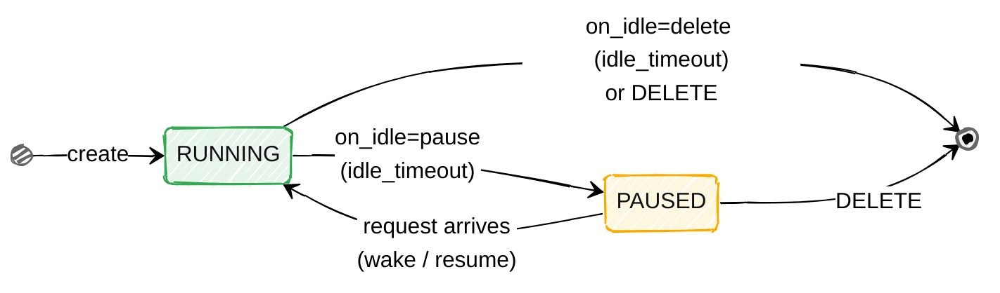
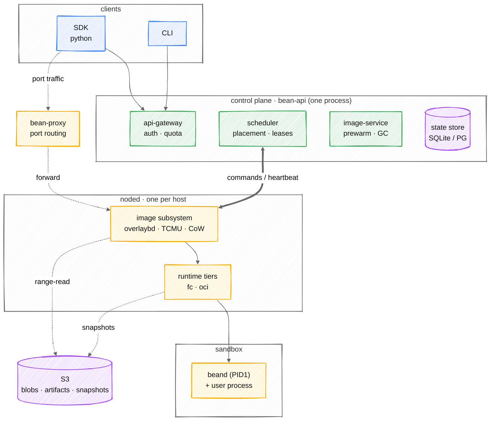

<div align="center">

# 🫛 bean

**A sandbox platform for AI agents** — run untrusted code in hardware isolation:
create it, exec into it, snapshot it, fan it out. Any OCI image, no template build step.

*Built from zero to one, under continuous iteration and optimisation.*


[中文版](README.zh.md) · [What works](#what-works) · [Quick start](#quick-start) · [Architecture](#architecture) · [Docs](#documentation) · [Contributing](CONTRIBUTING.md)

</div>

---

## What it's for

Four shapes of work, one underlying capability:

- **Agent hosting** — an agent lives inside the sandbox; run Claude Code or another coding agent in an isolated environment it can freely modify.
- **Agent-invoked sandboxes** — an agent or platform spins one up on demand to execute code or run a data-analysis job, then throws it away.
- **RL rollouts** — long-lived training environments fanned out by the hundred, one prepared checkpoint cloned into many.
- **Benchmarks / eval** — SWE-bench-class suites over thousands of heterogeneous multi-GB images, each in its own sandbox.

Two runtimes cover these; you pick per workload, neither is second-class:

- **Firecracker microVM** (`fc`) — agent hosting, agent-invoked sandboxes, RL rollouts. A hardware-isolation boundary for untrusted or long-lived code, with snapshot/restore and fork so one prepared environment clones into many.
- **OCI + gVisor** (`runsc`/`runc`) — benchmarks and eval. Run any image directly with no per-image template build, OCI driven with no containerd, plus image build and full lifecycle management.

One self-contained stack underneath — control plane, node daemon, in-sandbox agent,
CLI, SDK — sharing the same image pipeline, snapshot machinery, scheduler and network
isolation, with **no Kubernetes and no containerd on the hot path**.

> **Status: working system, incomplete platform.** The microVM tier boots real
> Firecracker VMs on real hardware, and every number below is measured rather
> than projected. The container tier (gVisor/runc) runs too, driving the OCI
> runtime directly with no containerd, though the microVM tier is the more
> heavily tested path; the VMM is not yet confined by a jailer. Read
> [What works](#what-works) before planning around it.

---

## What works

Measured on an AMD EPYC 7542 (Zen 2) host, guest kernel 6.1.102, Alpine 3.20.

### Lifecycle

```
create → exec → cp → pause → resume → snapshot → create-from-snapshot → destroy
```

Those are the operations. The states a sandbox actually moves through are fewer —
`create` has one entry whether it boots an image or restores a snapshot, and idle
sweeps or an explicit `DELETE` are the only ways out:



| operation | measured | notes |
|---|---|---|
| create (image cached) | **952 ms** | 234 ms runtime + 770 ms to a reachable agent |
| create (cold image) | 5–10 s busybox … 2 m 45 s alpine on poor network | why prewarm is required, not an optimisation |
| destroy | **214 ms** | was 5.25 s — [decisions §1](docs/decisions.md) |
| snapshot (full) | 1.5 s, 15.5 MB | |
| create-from-snapshot | **392 ms** on a node-local cache hit | first time on a node ~950 ms to unpack the bundle, cached after |

### Snapshots — three kinds, different semantics

Not three sizes of one thing:

| kind | flag | measured | restore | portability |
|---|---|---|---|---|
| full | *(default)* | 15.5 MB | resumes; process tree survives | pinned to CPU vendor + family |
| filesystem-only | `--no-memory` | **6109 B** | boots fresh, files intact | **any CPU** |
| incremental | `--base SNAP` | **298 KB** | resumes | pinned to CPU vendor + family |

Guest memory records what the CPU it booted on offered, and vendor/family cannot
be masked away — so a memory snapshot only restores on a compatible CPU, and the
scheduler enforces that as a hard filter (`409 INCOMPATIBLE_CPU`) rather than
placing it and letting the guest misbehave afterwards. `--no-memory` trades
resume for portability; `--base` stores only the pages written since its parent.

```bash
bean snapshot create $SBX --name base
bean snapshot create $SBX --name step1 --base snap_...   # 298 KB, not 15.5 MB
bean run --snapshot snap_...
```

### Networking

Each sandbox gets its own network namespace, a tap device and a `/30`, with two
layers of NAT to the uplink. Egress works; the ranges a sandbox has no business
reaching are denied by default.

| from inside a booted guest | result |
|---|---|
| public address | reachable, 7.9 ms |
| DNS | resolves |
| cloud metadata `169.254.169.254` | denied |
| the node's own address | denied |
| the node's gateway | denied |

The denials are only meaningful because the reachability checks pass in the same
guest at the same instant — an unconfigured interface would make every denial
"pass" while nothing worked at all, which is exactly the bug the end-to-end probe
was written to catch. `hack/guest-egress-probe.sh` asserts all seven from inside a
real microVM over `exec`; [docs/network.md](docs/network.md) §5a explains which
of the two rule scopes actually denies what.

Guest addresses are identical in every sandbox on purpose: a restored snapshot
comes back with the address it was captured with, so a constant is what lets one
checkpoint fan out to many sandboxes without collisions.

### Also working

- **Images** — OCI pull and conversion, private registries (credentials
  AES-256-GCM at rest), prewarm with image-affinity scheduling
- **Builds** — Dockerfile through BuildKit with streaming logs and cancellation,
  and `commit` to freeze a running sandbox's filesystem into a reusable base image
- **Container tier (gVisor/runc)** — `--runtime runsc` or `--runtime runc` drive
  the OCI runtime directly, no containerd, sharing the microVM tier's rootfs
  providers; the tier that serves the benchmark workload, alongside `fc` and the
  dev-only `local`. The microVM tier is the more heavily tested path today
- **`fork`** — N independent sandboxes from one source, one checkpoint per batch,
  the source left running
- **Scheduling** — two-level placement; commitments persisted so replicas cannot
  double-place and a restart does not lose the ledger; configurable overcommit
- **Snapshot blobs on S3** — SigV4 implemented against the standard library, no
  AWS SDK; multipart upload and range reads
- **Tracing** — OpenTelemetry with W3C `traceparent` across gateway → noded →
  in-sandbox agent, arriving as one span tree per request
- **Node-direct data plane** — `{port}-{sandbox}` in the Host reaches that port in
  that guest, whether it is a user's server or the agent. One mechanism rather than
  two: no registration call, no host-port pool. With `BEAN_PROXY_URL` set, `exec`
  and file transfer take this path straight to the agent instead of relaying
  through the control plane, with the node's forwarder injecting the per-sandbox
  token so the client never holds it; unset, they fall back to the gateway relay
- **Warm snapshots** — prewarm produces a resumable base snapshot, so a create
  restores instead of booting, and the scheduler prefers nodes that can. Bounded on
  disk with LRU eviction
- **Postgres** — `bean-api --postgres`, which is what allows more than one replica;
  SQLite is one file and two replicas cannot share it. The requirements are run
  against a real Postgres 16 by `hack/postgres-conformance.sh`, and the store holds
  no mutex — atomicity is in the statements, so the database arbitrates

### Not built yet

| feature | status |
|---|---|
| jailer chroot | 📐 The VMM drops to an unprivileged uid, runs in a per-sandbox cgroup, and has its own pid, mount and network namespaces by default. What jailer would add on top is a `chroot` and a device allowlist — [#20](https://github.com/garysng/bean/issues/20) phase 2, and probably not the right shape |
| Volumes | 📐 |
| Per-port access control | 📐 Any port on a sandbox is reachable by anything that can reach bean-proxy — [#50](https://github.com/garysng/bean/issues/50) |
| overlaybd | ⚠️ Wired in and measured on one host. **3.32x less disk** for three images sharing a base, and a shared layer converted once per node rather than once per image (0.49 s of CPU for the second image against 2.24 s). With layers published to an object store a create is **1.3 s against dm-snapshot's 14.3 s**; a *cold* create is unchanged, and cannot be improved — a gzipped tar has no block index to seek into, so the first encounter anywhere always converts. Opt-in via `--fc-overlaybd`; dm-snapshot remains the default. **Under 256 concurrent creates on a 128-core host it is 4.2x faster on rootfs setup** (3.809 s -> 0.908 s) and 1.9x on throughput (47.5 -> 88.0 creates/s), because dm-snapshot forks `losetup`/`dmsetup` per sandbox while overlaybd writes configfs. `commit` on this backend is unexercised, and the cross-node path has only been exercised on one machine. [docs/image-pipeline.md](docs/image-pipeline.md) §7 |

---

## Quick start

Needs a Linux host with `/dev/kvm`, root, and `dmsetup` / `losetup`. Go 1.26.

```bash
make bin                           # five binaries into ./bin
sudo hack/build-assets.sh          # kernel + agent disk + base image, into /var/lib/bean

# BIN is where the stack script looks for the binaries it starts
sudo BIN=$PWD/bin hack/dev-fc-stack.sh start   # gateway on :18080, one node

export PATH=$PWD/bin:$PATH
export BEAN_BASE_URL=http://127.0.0.1:18080 BEAN_API_KEY=devkey
SBX=$(bean run --image alpine:3.20 --quiet)
bean exec $SBX -- sh -c 'echo hello'
bean kill $SBX

sudo BIN=$PWD/bin hack/dev-fc-stack.sh stop
```

For incremental snapshots, dirty-page tracking has to be on before a guest boots
— it cannot be enabled for a sandbox that is already running:

```bash
NODED_FLAGS="--track-dirty-pages" sudo BIN=$PWD/bin hack/dev-fc-stack.sh start
```

Sandbox networking is off unless you name a guest subnet and an uplink, because
turning it on writes iptables rules into the host's own tables:

```bash
NODED_FLAGS="--guest-subnet 172.31.0.0/30 --uplink eth0 --guest-dns 1.1.1.1" \
  sudo BIN=$PWD/bin hack/dev-fc-stack.sh start
```

A node started without `--guest-subnet` boots sandboxes with no interface at all
and says so in its log — worth knowing before debugging inside a guest, since
"pip fails because of a proxy" and "pip fails because this node gave the sandbox
no NIC" look identical from in there.

---

## Architecture

```
  SDK / CLI ──REST──▶ bean-api ──gRPC──▶ noded ──vsock──▶ beand
                      │  scheduler        │  runtime         (PID 1 in guest)
                      │  image service    │  image provider
                      └─ SQLite           └─ Firecracker
                           │
                         S3 (snapshot blobs)
```

Five binaries: `bean` (CLI), `bean-api` (gateway, with the scheduler in-process
so placement and commitment happen in one transaction), `noded` (one per host),
`bean-proxy` (data-plane port routing), and `beand` (PID 1 inside each sandbox,
shipped on its own read-only disk so user images need no modification).

The same stack drawn as four bands — clients, control plane, nodes, sandbox —
with `bean-proxy` on the data-plane path for port traffic and S3 backing the node:



### How a sandbox boots

```
1. image provider assembles a rootfs block device
     shared read-only base (loop) + per-sandbox sparse CoW
     → dm-snapshot → /dev/mapper/bean-<id>
2. network: a netns, a tap, a veth pair to the host, NAT and filter rules
3. noded execs firecracker *inside that netns*
     virtio-blk: agent disk as root device, user image as /dev/vdb
     vsock for the agent, tap registered before InstanceStart
     init=/bean/beand, with ip= so the kernel configures eth0
4. beand as PID 1: mount matrix, then pivot into the user image
```

Four ordering constraints in there are load-bearing, and every one was found the
hard way:

- A CPU template must be applied **before** `InstanceStart`. A guest reads CPUID
  once during early boot and caches it — glibc picks its string routines from it
  — so masking later masks features the guest already committed to using.
- A NIC must be registered **before** `InstanceStart` too; the endpoint is
  pre-boot only, and a guest that misses it runs its whole life without an
  interface.
- The VMM must be `exec`'d **inside** the sandbox's netns. `setns` is per-thread
  and the Go runtime migrates goroutines at every blocking point, so this needs
  `LockOSThread` around setns/Start/setns-back in one goroutine.
- On restore, the CoW layer must be seeded **before** the dm-snapshot device is
  assembled. A dm-snapshot reads its exception table into kernel memory at
  activation and never re-reads it, so bytes written afterwards are invisible.
  The failure is *silent*: `ls` reports the right size, `cat` returns zeroes,
  `dmesg` says nothing. [decisions §3.0](docs/decisions.md).

The last one is the shape to internalise: each of these is a step that *looks*
done from every vantage point except the one that matters. The network stack had
five correct layers and no address in the guest, and every assertion passed.

---

## Documentation

Design docs carry per-section delivery status (✅ implemented / ⚠️ partial /
📐 design only), because writing intent and reality the same way is exactly what
made networking and jailer look shipped. Convention in
[architecture.md §0](docs/architecture.md).

**Authority order: code > `status.md` > `decisions.md` > design docs.**

| document | what's in it |
|---|---|
| [glossary.md](docs/glossary.md) | **the terms** — sandbox, image, snapshot, the lifecycle verbs, the runtime tiers — defined once |
| [status.md](docs/status.md) | **what is actually built**, with measurements |
| [decisions.md](docs/decisions.md) | **why** each choice was made — measured data, competitor comparisons, and the traps that only appeared on hardware |
| [architecture.md](docs/architecture.md) | components, design decisions, state machine |
| [architecture-diagrams.md](docs/architecture-diagrams.md) | the same architecture as diagrams only, rendered on GitHub |
| [tech-stack.md](docs/tech-stack.md) | every dependency, what it does here, and what it is instead of |
| [vm-assembly.md](docs/vm-assembly.md) | how a microVM is assembled, and the two orderings that must not change |
| [image-pipeline.md](docs/image-pipeline.md) | OCI ref → mountable block device |
| [s3-storage.md](docs/s3-storage.md) | hand-rolled SigV4, multipart, the `Blobs` contract |
| [noded-design.md](docs/noded-design.md) | node daemon and in-sandbox agent |
| [api-design.md](docs/api-design.md) | REST and gRPC surface, auth, error codes |
| [snapshot-resume.md](docs/snapshot-resume.md) | pause/resume, snapshot, and create-from-snapshot — and why they are different operations |
| [image-build.md](docs/image-build.md) | build and commit |
| [build-service.md](docs/build-service.md) | 📐 discussion — should build be split out of noded, and what blocks it |
| [security-and-startup.md](docs/security-and-startup.md) | threat model, hardening, cold-start budget |
| [sdk-cli-design.md](docs/sdk-cli-design.md) | SDK and CLI |
| [network.md](docs/network.md) | ✅ netns per sandbox, the two filter scopes, and why a restored snapshot keeps its address |
| [exec-via-proxy.md](docs/exec-via-proxy.md) | how exec and file transfer reach the agent node-direct, and the credential knot that shaped it |
| [jailer.md](docs/jailer.md) | 📐 what a jailer chroot would cost, what it would break, and why it is not next |
| [warm-snapshots.md](docs/warm-snapshots.md) | 📐 booting once per image instead of once per sandbox |
| [competitive-analysis.md](docs/competitive-analysis.md) | e2b / Modal / Daytona / Morph / AgentENV, including how each one does networking |
| [roadmap.md](docs/roadmap.md) | phases, with actual progress noted |

`decisions.md` is the one to read if you are evaluating the approach: it records
what was measured, where competitors chose differently, and which conclusions
remain unverified.

---

## Development

```bash
make bin            # five binaries into ./bin
make test           # unit tests, race detector
make test-e2e       # end-to-end, local tier
make lint vet       # gofmt, go vet, and the ASCII check
make preflight      # exactly what CI runs, in the same order
make proto          # regenerate from proto/
```

Most of the interesting behaviour needs a KVM host, root, and device-mapper, so
those tests **skip** rather than fail on a developer machine — `go test ./...`
stays green without proving much. Cross-compile and run on a real host for
anything touching the microVM tier:

```bash
GOOS=linux GOARCH=amd64 go test -c -o /tmp/img.test ./internal/node/image/
scp /tmp/img.test root@host:/tmp/ && ssh root@host /tmp/img.test
```

[CONTRIBUTING.md](CONTRIBUTING.md) covers the rest: the ASCII rule and why it
exists, the two testing rules that came out of bugs which passed a fully green
suite, and how doc status markers are kept honest. Security policy and the two
known boundary gaps are in [SECURITY.md](SECURITY.md).

---

## License

MIT — see [LICENSE](LICENSE).
