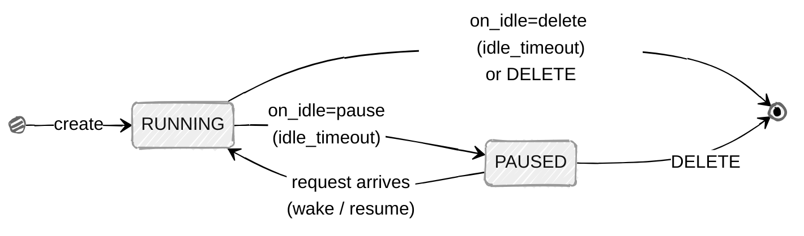
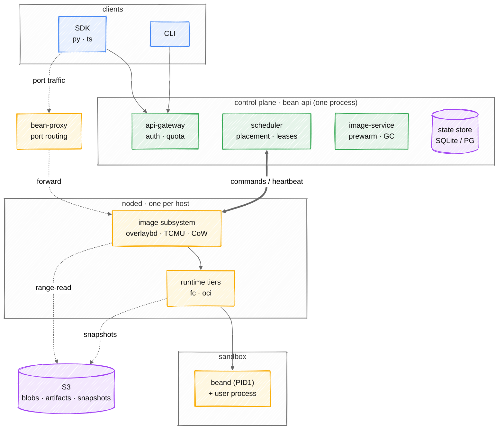

<div align="center">

# bean

**面向 AI agent 的 sandbox 平台** —— 在硬件隔离里跑不可信代码:创建、exec 进去、快照、扇出。
任意 OCI 镜像,不需要模板构建步骤。

`952 ms 到 agent 可达` · `每沙箱 44 KiB 磁盘` · `无 Kubernetes、无 containerd`

[English](README.md) · [已经可用的部分](#已经可用的部分) · [架构](#架构) · [文档](#文档)

</div>

---

## 这是做什么的

四类工作,底层是同一套能力:

- **Agent 托管** —— agent 就住在 sandbox 里;在一个它可随意改动的隔离环境里运行 Claude Code 或别的 coding agent。
- **Agent 按需拉起** —— agent 或平台按需拉起一个 sandbox 执行代码、跑数据分析任务,用完即弃。
- **RL rollout** —— 按百扇出的长活训练环境,一份备好的 checkpoint 克隆成许多。
- **Benchmark / 评测** —— SWE-bench 类套件,成千上万个异构、数 GB 的镜像,每个跑在自己的 sandbox 里。

两条 runtime 覆盖这些,按负载各取所需 —— 谁都不是二等公民:

- **Firecracker microVM**(`fc`) —— agent 托管、agent 按需拉起、RL rollout。给不可信或长活代码一道硬件隔离边界,快照/restore 与 fork 让一份备好的环境克隆成许多。
- **OCI + gVisor**(`runsc`/`runc`) —— benchmark 与评测。任意镜像直接跑,不需每镜像一次模板构建;OCI 直驱不经 containerd,外加镜像构建与完整生命周期管理。

底层共用一套自包含的栈 —— 控制面、节点守护进程、沙箱内 agent、CLI、SDK —— 共享同一条镜像
流水线、快照机制、调度器与网络隔离,**热路径上没有 Kubernetes,也没有 containerd**。

> **状态:系统能跑,平台未完。** microVM 档在真机上启动真的 Firecracker VM,下面每个数字
> 都是实测而非推算。容器档(gVisor/runc)也能跑,直接驱动 OCI 运行时、不经 containerd,不过
> microVM 档是目前测得更充分的路径;VMM 还没被 jailer 收进 chroot。
> 在此之上做规划前请先读 [已经可用的部分](#已经可用的部分)。

---

## 为什么不用 e2b / Modal / 裸容器

| | 做法 | 规模化时的代价 |
|---|---|---|
| e2b | Firecracker + 每镜像一次模板构建 | 每个镜像一次模板构建,每次数分钟 —— 成千上万镜像下不可用 |
| Modal | 自研容器运行时 + 懒加载文件系统 | 不可自托管 |
| K8s + Pod | 每任务一个容器 | 不可信代码没有 VM 边界;调度与网络栈都重 |
| **bean** | Firecracker + 共享基础镜像 + 每沙箱 CoW | **每沙箱 44 KiB 磁盘**,952 ms 到 agent 可达 |

关键转折是:沙箱**不会**拿到镜像的自有副本。每节点一份只读基础镜像 loop 挂载后共享,
每个沙箱通过 device-mapper 在其上获得一个稀疏的写时复制层。扇出一百个 agent 沙箱 ——
或把一个 eval 镜像扇出成一百个克隆 —— 代价就是一百个稀疏文件。

---

## 已经可用的部分

实测环境:AMD EPYC 7542(Zen 2)宿主,guest 内核 6.1.102,Alpine 3.20。

### 生命周期

```
create → exec → cp → pause → resume → snapshot → create-from-snapshot → destroy
```

上面是可以做的操作。而沙箱真正经历的状态更少 —— `create` 只有一个入口,无论它是冷启动
镜像还是从快照恢复;而 idle 清扫或一次显式 `DELETE` 是仅有的出口:



| 操作 | 实测 | 说明 |
|---|---|---|
| create(镜像已缓存) | **952 ms** | 234 ms 运行时 + 770 ms 到 agent 可达 |
| create(冷镜像) | busybox 5–10 s … 网络差时 alpine 2 分 45 秒 | 这就是 prewarm 是必需项而非优化项的原因 |
| destroy | **214 ms** | 曾是 5.25 s —— [decisions §1](docs/zh/decisions.md) |
| snapshot(全量) | 1.5 s,15.5 MB | |
| restore | 节点本地缓存命中 **392 ms** | 其中 `/snapshot/load` 只占 7 ms;首次 restore 要付约 950 ms 解包,该节点后续每次都不用再付 |

### 快照 —— 三种语义,不是三种大小

不是同一个东西的三档尺寸:

| 种类 | 参数 | 实测 | restore 后 | 可移植性 |
|---|---|---|---|---|
| 全量 | *(默认)* | 15.5 MB | 恢复运行,进程树存活 | 绑定 CPU vendor + family |
| 仅文件系统 | `--no-memory` | **6109 B** | 重新 boot,文件完好 | **任意 CPU** |
| 增量 | `--base SNAP` | **298 KB** | 恢复运行 | 绑定 CPU vendor + family |

Guest 内存记录了它启动时那颗 CPU 提供的东西,而 vendor 与 family **无法被屏蔽掉** ——
所以带内存的快照只能在兼容 CPU 上恢复。调度器把这一点作为硬过滤执行
(`409 INCOMPATIBLE_CPU`),而不是先放上去、之后让 guest 出怪问题。`--no-memory` 用
"放弃恢复运行"换可移植性;`--base` 只存相对父快照写过的页。

```bash
bean snapshot create $SBX --name base
bean snapshot create $SBX --name step1 --base snap_...   # 298 KB,而非 15.5 MB
bean run --snapshot snap_...
```

### 网络

每个沙箱有自己的 network namespace、一个 tap 设备和一个 `/30`,到上行链路之间有两层 NAT。
出网可用;沙箱没理由访问的地址段默认拒绝。

| 从已启动的 guest 内部 | 结果 |
|---|---|
| 公网地址 | 可达,7.9 ms |
| DNS | 能解析 |
| 云元数据 `169.254.169.254` | 拒绝 |
| 节点自身地址 | 拒绝 |
| 节点网关 | 拒绝 |

这些"拒绝"之所以有意义,只因为**同一个 guest、同一时刻**的可达性检查是通过的 ——
一个没配好的网卡会让所有拒绝项都"通过",而实际上什么都不通,这正是那个端到端探针
被写出来要抓的 bug。`hack/guest-egress-probe.sh` 在真 microVM 里通过 `exec` 断言全部七项;
[docs/zh/network.md](docs/zh/network.md) §5a 说明了两个规则作用域里究竟是哪一个在拒绝什么。

每个沙箱的 guest 地址都相同,这是有意为之:恢复出的快照会带着被捕获时的地址回来,
所以用一个常量才能让同一份 checkpoint 扇出成许多沙箱而不冲突。

### 其他已可用

- **镜像** —— OCI 拉取与转换、私有 registry(凭据静态 AES-256-GCM 加密)、
  带镜像亲和调度的 prewarm
- **构建** —— 通过 BuildKit 构建 Dockerfile,日志流式输出且可取消;`commit` 可把运行中
  沙箱的文件系统冻结成可复用的基础镜像
- **容器档(gVisor/runc)** —— `--runtime runsc` 或 `--runtime runc` 直接驱动 OCI
  运行时,不经 containerd,与 microVM 档共用同一套 rootfs provider;服务 benchmark 负载的
  那一档,和 `fc`、开发用 `local` 并列。microVM 档是目前测得更充分的路径
- **`fork`** —— 从一个源产出 N 个独立沙箱,每批只做一次 checkpoint,源沙箱保持运行
- **调度** —— 两级放置;承诺量持久化,所以副本之间不会重复放置、重启也不丢账本;
  overcommit 可配置
- **快照 blob 落 S3** —— 基于标准库自实现 SigV4,不用 AWS SDK;支持分片上传与 range 读
- **追踪** —— OpenTelemetry,W3C `traceparent` 贯穿 gateway → noded → 沙箱内 agent,
  每个请求汇成一棵 span 树
- **节点直连数据平面** —— Host 里的 `{port}-{sandbox}` 直达该 guest 的那个端口,
  无论它是用户的 server 还是 agent。一套机制而非两套:没有注册调用、没有宿主端口池,
  `exec` 和文件传输也不再经控制面中转
- **Warm snapshot** —— prewarm 产出一份可 resume 的基础快照,于是 create 变成 restore
  而不是 boot,调度器也会优先选能做到这点的节点。磁盘上有上限,按 LRU 淘汰
- **Postgres** —— `bean-api --postgres`,这正是支持多副本的前提;SQLite 是单文件,
  两个副本无法共享。需求由 `hack/postgres-conformance.sh` 对真实 Postgres 16 跑通,
  store 不持有 mutex —— 原子性在语句里,由数据库仲裁

### 尚未构建

| | |
|---|---|
| jailer chroot | 📐 VMM 已降到非 root uid、跑在每沙箱 cgroup 里,默认也有自己的 pid、mount、network 命名空间。jailer 在此之上还能加的是一个 `chroot` 和设备白名单 —— [#20](https://github.com/garysng/bean/issues/20) 第二阶段,而且未必是对的形态 |
| 卷 | 📐 |
| 按端口访问控制 | 📐 沙箱上任何端口,只要能到达 bean-proxy 就能访问 —— [#50](https://github.com/garysng/bean/issues/50) |
| overlaybd | ⚠️ 已接入,在一台宿主上实测过。三个镜像共享一个 base 时**磁盘少 3.32 倍**,共享层每节点只转换一次而非每镜像一次(第二个镜像 0.49 s CPU,对比 2.24 s)。层发布到对象存储后,create 是 **1.3 s,对比 dm-snapshot 的 14.3 s**;*冷* create 不变,也无法改进 —— gzip tar 没有块索引可 seek,所以任何地方首次遇到都要转换。用 `--fc-overlaybd` 开启,dm-snapshot 仍是默认。**128 核机器 256 并发 create 下 rootfs 组装快 4.2 倍**(3.809 s → 0.908 s)、吞吐快 1.9 倍(47.5 → 88.0 creates/s),因为 dm-snapshot 每沙箱 fork `losetup`/`dmsetup` 而 overlaybd 只写 configfs。这个后端上的 `commit` 未经检验,跨节点路径也只在一台机器上跑过。[docs/image-pipeline.md](docs/image-pipeline.md) §7 |

---

## 快速开始

需要一台有 `/dev/kvm`、root 权限、以及 `dmsetup` / `losetup` 的 Linux 宿主。

```bash
make build
sudo hack/build-assets.sh          # guest 内核 + agent 磁盘
sudo hack/build-assets.sh kernel   # Firecracker CI 的 vmlinux-6.1.102

sudo hack/dev-fc-stack.sh start    # gateway 在 :18080,一个节点

export BEAN_BASE_URL=http://127.0.0.1:18080 BEAN_API_KEY=devkey
SBX=$(bean run --image alpine:3.20 --quiet)
bean exec $SBX -- sh -c 'echo hello'
bean kill $SBX
```

要用增量快照,脏页跟踪必须在 guest 启动**之前**就打开 —— 已经在跑的沙箱无法再启用:

```bash
NODED_FLAGS="--track-dirty-pages" sudo hack/dev-fc-stack.sh start
```

要让沙箱有网络,启动时给出 guest 子网与上行网卡:

```bash
NODED_FLAGS="--guest-subnet 172.31.0.0/30 --uplink eth0 --guest-dns 223.5.5.5" \
  sudo hack/dev-fc-stack.sh start
```

不设 `--guest-subnet` 的节点会把沙箱启动成没有任何网卡的样子,并在日志里说明这一点 ——
因为"pip 装不上是因为代理"和"pip 装不上是因为这个节点根本没给网卡"只有一个值得去 guest
里调试。

---

## 架构

```
  SDK / CLI ──REST──▶ bean-api ──gRPC──▶ noded ──vsock──▶ beand
                      │  调度器            │  运行时          (guest 内 PID 1)
                      │  镜像服务          │  image provider
                      └─ SQLite           └─ Firecracker
                           │
                         S3(快照 blob)
```

四个二进制:`bean`(CLI)、`bean-api`(gateway,调度器在同进程内,这样放置与承诺发生在
同一个事务里)、`noded`(每宿主一个)、`beand`(每个沙箱内的 PID 1,装在自己的只读磁盘上,
所以用户镜像不需要任何改动)。

同一套栈画成四条带 —— 客户端、控制面、节点、沙箱 —— `bean-proxy` 在端口流量的数据面路径上,
S3 支撑节点:



### 一个沙箱如何启动

```
1. image provider 组装 rootfs 块设备
     共享只读基础层(loop)+ 每沙箱稀疏 CoW
     → dm-snapshot → /dev/mapper/bean-<id>
2. 网络:一个 netns、一个 tap、一对到宿主的 veth、NAT 与过滤规则
3. noded 在那个 netns 里 exec firecracker
     virtio-blk:agent 磁盘作根设备,用户镜像作 /dev/vdb
     agent 用 vsock;tap 必须在 InstanceStart 之前注册
     init=/bean/beand,并带 ip= 让内核自己配好 eth0
4. beand 作为 PID 1:先建挂载矩阵,再 pivot 进用户镜像
```

其中有四个顺序约束是承重的,而且每一个都是踩出来的:

- CPU template 必须在 `InstanceStart` **之前**应用。guest 在早期启动时读一次 CPUID 就缓存
  下来 —— glibc 据此挑选它的字符串例程 —— 所以之后再屏蔽,屏蔽掉的是 guest 已经决定要用
  的特性。
- 网卡同样必须在 `InstanceStart` **之前**注册;那个 endpoint 只在 boot 前可用,错过它的
  guest 会一辈子没有网卡。
- VMM 必须在沙箱的 netns **内部**被 exec。`setns` 是**按线程**生效的,而 Go 运行时会在每个
  阻塞点迁移 goroutine,所以这需要在同一个 goroutine 里用 `LockOSThread` 把
  setns/Start/setns-back 包起来。
- restore 时,CoW 层必须在 dm-snapshot 设备**组装之前**写好种子数据。dm-snapshot 在激活时
  把异常表读进内核内存后就不再重读,所以之后写入的字节是**看不见的**。这个失败是**静默**的:
  `ls` 报告正确的大小,`cat` 返回全零,`dmesg` 什么都不说。见
  [decisions §3.0](docs/zh/decisions.md)。

最后一条是真正该内化的形状:上面每一步都是"从除了真正要紧的那个视角以外,处处看起来都做完了"
的步骤。网络栈曾经有五层都正确、guest 里却没有地址,而所有断言都是绿的。

---

## 文档

设计文档按小节标注交付状态(✅ 已实现 / ⚠️ 部分 / 📐 仅设计),因为把意图和现实用同一种
写法写下来,正是当初让网络与 jailer 看起来像已交付的原因。约定见
[architecture.md §0](docs/zh/architecture.md)。

**权威顺序:代码 > `status.md` > `decisions.md` > 设计文档。**

| | |
|---|---|
| [status.md](docs/zh/status.md) | **实际构建了什么**,带实测数据 |
| [decisions.md](docs/zh/decisions.md) | 每个选择**为什么**这么做 —— 实测数据、竞品对比,以及只在真机上才现形的陷阱 |
| [architecture.md](docs/zh/architecture.md) | 组件、设计决策、状态机 |
| [vm-assembly.md](docs/zh/vm-assembly.md) | microVM 如何组装,以及两个不能改的顺序 |
| [image-pipeline.md](docs/zh/image-pipeline.md) | OCI 引用 → 可挂载块设备 |
| [s3-storage.md](docs/zh/s3-storage.md) | 手写 SigV4、分片上传、`Blobs` 契约 |
| [noded-design.md](docs/zh/noded-design.md) | 节点守护进程与沙箱内 agent |
| [api-design.md](docs/zh/api-design.md) | REST 与 gRPC 表面、认证、错误码 |
| [snapshot-resume.md](docs/zh/snapshot-resume.md) | pause/resume、snapshot、从快照创建 —— 以及它们为何是不同的操作 |
| [image-build.md](docs/zh/image-build.md) | 构建与 commit |
| [security-and-startup.md](docs/zh/security-and-startup.md) | 威胁模型、加固、冷启动预算 |
| [sdk-cli-design.md](docs/zh/sdk-cli-design.md) | SDK 与 CLI |
| [network.md](docs/zh/network.md) | ✅ 每沙箱一个 netns、两个过滤作用域,以及恢复的快照为何保留原地址 |
| [warm-snapshots.md](docs/zh/warm-snapshots.md) | 📐 每镜像 boot 一次,而非每沙箱 boot 一次 |
| [competitive-analysis.md](docs/zh/competitive-analysis.md) | e2b / Modal / Daytona / Morph / AgentENV,含各家的网络做法 |
| [roadmap.md](docs/zh/roadmap.md) | 阶段划分,标注实际进度 |

如果你在评估这套方案,`decisions.md` 是该读的那一份:它记录了测了什么、竞品在哪里选择不同、
以及哪些结论仍未被验证。

---

## 开发

```bash
make build          # 编译全部
make test           # 单元测试,带 race 检测
make test-e2e       # 端到端,local 档
make lint vet       # gofmt、go vet,以及下面那个 ASCII 检查
make proto          # 从 proto/ 重新生成
```

### 只有文档可以有中文

代码、注释、测试名、脚本、配置、commit message 和分支名一律 ASCII。理由很实际:
读不了中文的人应该能在除文档以外的每个文件上工作,而 `git log` 应该对所有人保持可读 ——
一旦一半的历史需要翻译,它就不再可读了。

`hack/check-ascii.sh` 强制执行这条,并作为 `make lint` 的一部分运行。它只拒绝 CJK,
不是拒绝所有非 ASCII 字符:破折号、箭头和制表符在注释与图里是有意使用的。加上 `--commits`
还会检查尚未推送的 commit 的 message —— 界线划在这里,是因为为了改一条 message 而重写
已发布的历史,代价大于那条 message 的价值。

大部分有意思的行为都需要 KVM 宿主、root 和 device-mapper,所以那些测试在开发机上是
**skip** 而不是 fail —— `go test ./...` 会保持绿色,但也没证明多少东西。任何触及 microVM
档的改动,都要交叉编译后到真机上跑:

```bash
GOOS=linux GOARCH=amd64 go test -c -o /tmp/img.test ./internal/node/image/
scp /tmp/img.test root@host:/tmp/ && ssh root@host /tmp/img.test
```

### 两条值得写下来的测试规则

**要穿透到真实的持久层去验证。** 当状态同时存在于内存和磁盘上时,读内存的测试什么都
证明不了。上面那个静默的文件系统损坏 bug 通过了三层测试:单元测试检查了 tar 的往返
(没错 —— 数据**确实**写了)、端到端测试从 guest 内部读了那个文件(命中 page cache)、
`dmsetup status` 查的是错的设备。没有一个读了恢复出来的块设备。快照断言必须先
`drop_caches`。

**然后把修复改回坏的,确认测试会失败。** 对那个 bug,所有文件级断言在坏实现下都是绿的,
所以这是唯一能知道新测试有没有价值的办法。loop 设备泄漏和 merge 顺序测试也一样。

---

## 许可

尚未选定。
