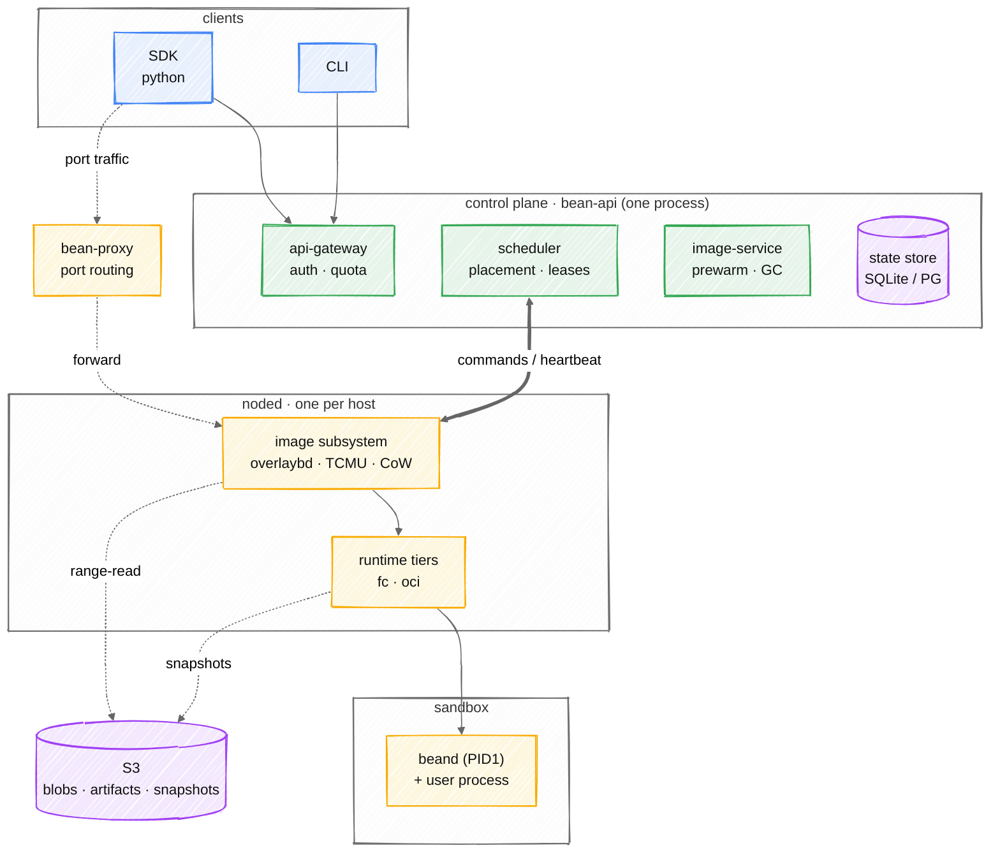
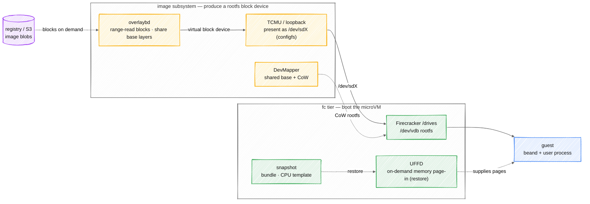
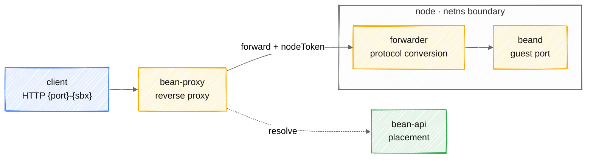
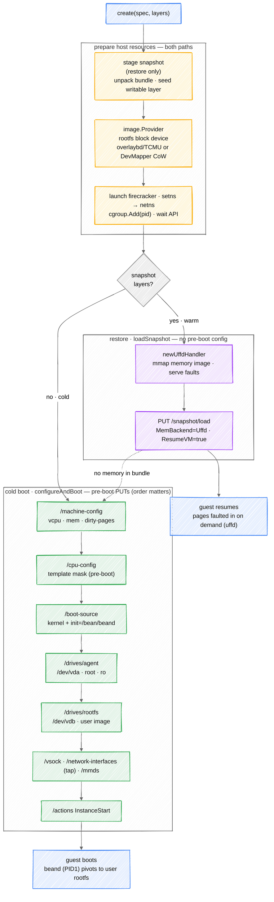
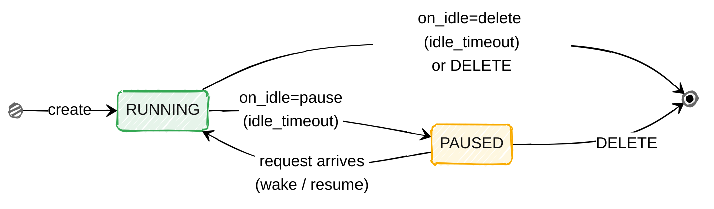

# Bean architecture diagrams

> Hand-drawn architecture views for the bean sandbox platform. Colors mark roles:
> blue = client, green = control plane, yellow = data plane, purple = storage.
> Diagrams follow the code, not older docs — e.g. the image block layer is TCMU
> (`internal/node/image/obdtcmu_linux.go`), not ublk.
>
> These render natively on GitHub. Each ```mermaid block below is the source.

## 1. Overall architecture

Four bands top to bottom: clients → control plane → nodes → sandbox. S3 backs the
node. `bean-proxy` is the data-plane path for port traffic into a sandbox.



## 2. Inside one noded

Left: the image subsystem turns OCI layers into a block device. Right: the runtime
tiers boot it — `fc` (microVM, with UFFD + snapshot) or `oci` (container: runc /
runsc). Each block on the arrows names the responsibility that technology owns —
this is where the platform's core techniques earn their place.

**What each key technology is responsible for:**

| Tech | Owns | Why it exists |
|---|---|---|
| **overlaybd** | Turning OCI layers into a virtual block device, read on demand | Layers stay separate and shared — 3.1× less disk for a SWE-bench set; range-reads blocks from the registry so a large image mounts after ~20% of a layer, no full download |
| **TCMU / loopback** | Presenting the overlaybd device to the kernel as `/dev/sdX` | The kernel SCSI target, driven via configfs, is what makes a userspace block source attachable to a VM. *(Docs call this "ublk"; the code is TCMU — `obdtcmu_linux.go`.)* |
| **DevMapper (CoW)** | Alternative rootfs: one shared base + a per-sandbox copy-on-write layer | 44 KiB of disk per sandbox when fanning out clones of one flattened image |
| **UFFD** | Supplying guest memory pages on demand during restore | A restore writes nothing and pays only for pages actually faulted in — cut a 512 MiB restore from 1.4 s to ~0.1 s |



The runtime tier itself (fc with its UFFD/snapshot machinery, and the oci
container tier with runc / runsc) is detailed in the next section.

## 3. Port forwarding into a sandbox

A client addresses `{port}-{sandbox}`. `bean-proxy` asks bean-api which node holds
it, then forwards with a node token. The node's forwarder does the protocol
conversion — it's the only thing that can reach the agent inside the sandbox's
network namespace.



## 4. Assembling an fc microVM

How `FCRuntime.create` turns a spec into a running guest
(`internal/node/runtime/fc_linux.go`). Host prep is shared, then the path
**branches on whether the spec carries snapshot layers**:

- **cold boot** (`configureAndBoot`) — no snapshot. A fixed sequence of
  Firecracker API `PUT`s configures the machine, then `InstanceStart` boots it.
  Order is load-bearing: the CPU mask and the network interface must exist
  pre-boot, and drive order fixes device naming (agent = `/dev/vda` root, user
  image = `/dev/vdb`).
- **restore** (`loadSnapshot`) — snapshot present. Nothing may be configured
  first (the snapshot carries the whole machine state); a `uffd` handler mmaps
  the memory image, then `/snapshot/load` with `ResumeVM` brings the guest back
  live, faulting pages in on demand. A memory-less checkpoint falls back to the
  cold-boot path (boot onto the restored filesystem).



## 5. Sandbox lifecycle state machine

The two settled states a sandbox rests in on a node, and what drives the
transitions — the sandbox's **lifecycle policy** (`Lifecycle{IdleTimeout,
OnIdle: pause|delete}`, `internal/node/manager.go`).

**The idle sweep only acts on RUNNING** (:1451 — it skips any sandbox not in
`StateRunning`). When a RUNNING sandbox has been idle past `idle_timeout`,
`on_idle=pause` freezes it into PAUSED and `on_idle=delete` destroys it. A PAUSED
sandbox is never touched by the sweep — it does not idle out, and only an explicit
`DELETE` removes it.

- **RUNNING → PAUSED** — `on_idle=pause`, idle past `idle_timeout`
- **PAUSED → RUNNING** — a request arrives and transparently wakes it (`Resume`,
  :457/:1370) — the frozen process resumes; nothing is rebuilt
- **RUNNING → gone** — `on_idle=delete` (idle_timeout) **or** an explicit `DELETE`.
  Two triggers, one operation (`Destroy`, :469).
- **PAUSED → gone** — explicit `DELETE` only; `on_idle` never fires here.

**There is one creation entry, `create` — not a separate `restore`.** The API has
a single create endpoint (`POST /v1/sandboxes`) that takes *either* an `image` or a
`snapshot` (mutually exclusive, `handleCreate`); it branches internally on which
was given. "restore" is not a user-facing operation, just the internal name of the
snapshot path (`StateRestoring` :1151 / `rt.Fork`) as opposed to the cold-boot path
(`StateStarting` :171 / `rt.Create`). Both make a brand-new sandbox and differ only
in *how it comes up* — boot the guest kernel vs. resume a captured memory image —
which is the split §4 draws. This diagram stays at the user/lifecycle level, so the
entry edge is simply `create`.

**Don't confuse either creation path with `resume`.** `resume` is the
PAUSED→RUNNING wake of an already-live, frozen sandbox (`StateResuming` :1382) — its
process never went away, so nothing is created. Creation makes a new sandbox;
resume just thaws an existing one.

**Node vs. control plane.** This diagram is the *node's* view, and the node holds
no terminal state — a destroyed sandbox is simply gone from its map. The *control
plane* does keep a `STOPPED` record (`store.SandboxStopped`, server.go:685) so a
deleted sandbox still has a queryable final state; that record lives in the
control-plane store, not on the node. Likewise `PULLING` (image fetch) is a
control-plane state; the node owns states from `STARTING` on.

Each transition runs through a transient `-ing` state in the code (`STARTING`,
`PAUSING`, `RESUMING`, `RESTORING`, `SNAPSHOTTING`) whose only job is rollback: a
failed `pause`/`resume` returns to the prior state; a failed `create`/`restore` is
dropped. `checkpoint` snapshots a RUNNING or PAUSED sandbox and returns it to that
same state. These are implementation detail, off the diagram.


