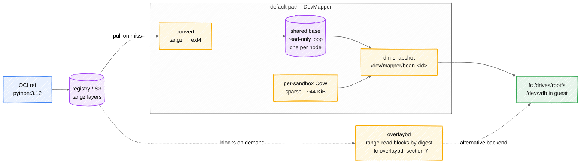

# The Image Path: OCI ref → a mountable block device

> 中文版:[zh/image-pipeline.md](zh/image-pipeline.md)

> The status-marker convention is defined in [architecture.md](architecture.md) §0.
> Implementation: `internal/node/image/` (registry / convert / devmapper / pulling).
> "How images get built" is in [image-build.md](image-build.md); this document is "how an existing image becomes something bootable".

What the user hands the platform is an ordinary OCI ref like `python:3.12`. What the fc tier
needs is a block device. This document is every step in between, plus where the 2m45s cold
start goes.



The default path is solid; overlaybd (dashed) is the opt-in alternative that skips
conversion and range-reads blocks instead. The rest of this document is each of these
steps, plus where the 2m45s cold start goes.

## 1. Three layers of Provider ✅

```
PullingProvider          triggers conversion on a cache miss, deduplicates concurrency
  └── DevMapperProvider  shared read-only base + one CoW per sandbox → /dev/mapper/bean-<id>
      (or FileProvider)  a full copy per sandbox, the fallback when dm is unavailable

OverlaybdProvider        alternative, --fc-overlaybd; layers shared by digest (section 7)
```

Why it is layered rather than one large provider: **"where the image comes from" and "how the
block device is assembled" are two different things**. `PullingProvider` wraps any inner
implementation, so the behaviour "pull on first use" does not have to be reimplemented in
every block-device backend.

`OverlaybdProvider` sits **beside** that stack rather than inside it, which is the one place
the original layering did not anticipate. It resolves an image to its layers itself, because
deciding which layers to fetch is the same decision as deciding whether to fetch them at all
(lazy pull fetches none). Wrapping it in `PullingProvider` would run the ext4 converter first
and produce an artifact overlaybd has no use for.

The `Provider` interface is small — assembling a device, plus reporting what the node holds:

```go
Name() string
Prepare(ctx, sandboxID, imageRef string, opts PrepareOptions) (*Rootfs, error)
Prewarm(ctx, imageRef string) error
Cached() (map[string]CachedImage, error)
Config(imageRef string) (*Config, error)   // §5
Digest(imageRef string) (string, error)
```

`Cached()` exists because **the node is the only authority on what it holds** — the heartbeat
reports that manifest, and the scheduler scores image affinity from it while a prewarm job
shows progress from it. Having the control plane infer "roughly what the node has" would
diverge from reality immediately.

## 2. Conversion: tar.gz layers → ext4 ✅

```
① ParseReference        parse the ref
② look in ImageDir      return directly if it exists ← immutable semantics, see below
③ FetchManifest         registry authentication + manifest parsing
④ sizeFor(manifest)     estimate the filesystem size from the compressed layer sizes
⑤ writeBaseImage        create a sparse file → mkfs.ext4 → mount
⑥ applyLayer per layer  unpack in order, handle whiteouts
⑦ add the directories the guest requires   mount points such as /proc /sys /dev
⑧ unmount → rename into place              atomic publication
⑨ write the image metadata file            remember which ref this file came from
```

**The metadata file is written after the image**, and the order is deliberate: it is the basis
for what `Cached()` reports, so writing it first would have the node claim to hold an
image that is not usable yet — the scheduler would send work over on that basis, and then
create would fail.

`refToFilename` encodes a ref into a filename (non-alphanumerics become separators), and
**different separators must not all map to the same character**, otherwise `a:b` and `a/b`
would collide. The metadata file is the answer to the reverse lookup: the original ref cannot be
derived back from the filename, so it is recorded separately.

### Immutable semantics ✅

```go
if _, err := os.Stat(final); err == nil {
    // Already converted. Images are immutable once written — a tag that
    // moves is a different digest and so a different file.
    return final, nil
}
```

The filename is derived from the ref, and **a tag that has moved is a different digest and
therefore a different file**. So "use it directly if it exists" cannot hand back stale
content. This is what makes conversion naturally idempotent, and why no cache-invalidation
logic is needed.

### Why nothing is visible until the rename ✅

The work directory and `ImageDir` have to sit on the same filesystem, because the last step is
a `rename`:

```
WorkDir/<tmp>.ext4  →  ImageDir/<name>.ext4
```

The consequence of not doing this is very concrete: a concurrent `Prepare` would see a
**half-written ext4**, mount it and fail — and the failure looks like "corrupt image" rather
than "race". This is the kind of bug that costs a day before you realise it is a race, so
requiring the same filesystem is the better trade.

### How the filesystem size is estimated ⚠️

```go
sizeMiB := (compressed >> 20) * 3      // sum of the compressed layers × 3
if sizeMiB < floor { sizeMiB = floor }  // not below DefaultSizeMiB
if sizeMiB < 256 { sizeMiB = 256 }      // hard floor
```

**This is an estimate, not a calculation.** The manifest carries only compressed sizes, and
the expansion ratio depends on the content (a text layer can reach 5×, already-compressed
binaries are close to 1×). × 3 is a middle value, with the floor covering small images.

This estimate **fails if it guesses low** (ENOSPC during conversion), while guessing high only
wastes the nominal size of a sparse file (actual occupancy follows what is written). So it
leans towards guessing high. **The hit rate of × 3 has never been measured** — if conversion
ENOSPC shows up, this is the first place to look.

### Whiteouts: OCI's deletion semantics ✅

Layers stack, so "delete" has to be expressed with marker files:

| Marker | Meaning | Handling |
|---|---|---|
| `.wh.<name>` | delete `<name>` from the layer below | `os.RemoveAll(victim)` |
| `.wh..wh..opq` | clear everything below this directory | `clearDir(dir)` |

The consequence of missing whiteout handling is that **files deleted in an upper layer
reappear inside the guest** — the typical symptom is a deleted key file or a cleaned-up build
cache coming back, while the image looks fine.

### Path-escape protection ✅

```go
func safeJoin(root, name string) (string, error) {
    clean := filepath.Clean("/" + name)
    joined := filepath.Join(root, clean)
    if joined != root && !strings.HasPrefix(joined, root+string(os.PathSeparator)) {
        return "", fmt.Errorf("layer entry %q escapes the image root", name)
    }
    return joined, nil
}
```

A malicious or malformed image can contain an entry like `../../etc/cron.d/x`.
**Conversion runs as root on the node**, so this is not "a privilege violation inside the
guest" but "writing the host filesystem directly" — it has to be refused during unpacking and
cannot be left to a later stage.

Doing `Clean("/" + name)` before the join is the key part: it reduces the `..` away **under
absolute-path semantics**, which is what makes the prefix check that follows meaningful.

### Deciding gzip by magic bytes rather than the media type 📐

The code branches on `layer.MediaType` alone (`convert_linux.go`, `applyLayer`); nothing in the
package sniffs the stream. The comment there describes an intent that was never implemented:

```go
// Most layers are gzipped; the media type says so, but some registries are
// loose about it, so the magic bytes decide.
```

The plan is to decide by magic bytes instead. Some registries' media types do not match the actual
content, and trusting the media type ends in unpacking a gzip stream as tar (an immediate failure)
or the reverse. Sniffing would be defensive at the cost of reading a few bytes. Whether to do it is
a separate decision and is not taken here.

## 3. Concurrency deduplication ✅

A batch of evals starting at once, all using the same uncached image, is the **default
scenario** rather than an edge case.

```go
func (p *PullingProvider) Prepare(...) (*Rootfs, error) {
    rootfs, err := p.Inner.Prepare(ctx, sandboxID, imageRef, opts)
    if !errors.Is(err, ErrNotCached) {
        return rootfs, err        // a hit, or some other error
    }
    if err := p.ensure(ctx, imageRef); err != nil {   // ← deduplication happens here
        return nil, err
    }
    return p.Inner.Prepare(ctx, sandboxID, imageRef, opts)
}
```

`ensure` uses an in-flight map to collapse concurrent requests for the same ref into one
conversion, with the rest waiting on the result. **Waiters share the result but keep their own
cancellation** — a client that has given up should not be held back by someone else's pull,
and the comment says so explicitly.

The consequence of not deduplicating is not just waste: N processes simultaneously `mkfs` and
unpack the same image into different temporary files, saturating disk IO, and in the end only
one of their outputs is useful.

## 4. Where the cold-start time goes ⚠️

Measured:

```
busybox   5–10 s
alpine    2m45s (on an unstable network)
```

**The 2m45s is almost entirely network** — pulling the compressed layers. The conversion
itself (mkfs + unpack) is seconds. So:

- **prewarm is a requirement, not an optimisation**. The images have to be spread across the
  target nodes before a batch of evals starts, otherwise the whole first batch of sandboxes
  sits waiting on downloads
- This is also **where overlaybd lazy-pull's value lies**: it trades "download every layer"
  for "read the blocks actually used, on demand". Measured at 7ms to mount, with only 19.6% of
  the layer bytes transferred before it mounts and files can be read
  (decisions §3.1). **Now wired in** — see §7

Image-affinity scheduling is the other face of the same problem: repeated eval runs on the
same image should land on nodes that already have it. That part is shipped (`Cached()` →
heartbeat → scheduling score).

## 5. Image configuration: ENV / ENTRYPOINT / CMD / WORKDIR ✅

An image is two things: layers, and a configuration blob describing how to start them.
The conversion above handles the first and **drops the second** — flattening layers into an
ext4 carries no metadata. So the config has to travel by a separate route, and without one
an image that depends on its own `ENV` or `WORKDIR` starts wrong with no error anywhere.

The route has two halves, because the registry is reachable at conversion time and not at
create time:

```
convert  FetchConfig(manifest.Config.Digest)  → Config{Env,Entrypoint,Cmd,WorkingDir,User}
             │                                    written into the .ref metadata file
             ▼
create   Provider.Config(ref) → *Config    ┐
         spec.Cmd / spec.Env               ├→ MergeConfig → Process{Argv,Env,Workdir,User}
                                           ┘        │
                                    StartUserProcessRequest → beand exec
```

Recorded in the same `.ref` file as the reference and digest rather than a second file, so
one atomic write publishes everything the node knows about an image and no reader can catch
the two disagreeing.

### Field-by-field correspondence

| OCI config | Where it goes | Status |
|---|---|---|
| `Env` | merged under the request's env, per key | ✅ |
| `Entrypoint` | head of `Argv`, always preserved | ✅ |
| `Cmd` | tail of `Argv`, replaced by the request's cmd if it has one | ✅ |
| `WorkingDir` | `Workdir`, used when the request names none | ✅ |
| `User` | carried on `Process`, **not applied** | 📐 |
| `VOLUME` / `EXPOSE` / `HEALTHCHECK` | ignored / metadata / not executed | ➖ same as a container runtime |

### The merge rules, and the one that is easy to get wrong

```
Argv     = Entrypoint ++ (request.Cmd if non-empty else image.Cmd)
Env      = image.Env, then request.Env overriding per key
Workdir  = request.Workdir, else image.WorkingDir, else the agent's default
```

**A request's command replaces `Cmd` and leaves `Entrypoint` alone.** This is what makes
`docker run python:3.12 -c 'print(1)'` pass an argument to the interpreter rather than trying
to exec `-c`. Overriding both together looks right for every image whose `Entrypoint` is empty
— which is most of what anyone tests with — and breaks precisely the images that declare one.
The table test in `config_test.go` pins this case specifically.

Env merges per key rather than wholesale for a related reason: an image's `PATH` and a caller's
one extra variable both have to survive, and a caller cannot be expected to restate the image's
environment in order to add to it.

### Where a config comes from, by image source

| Source | Config | Why |
|---|---|---|
| registry pull | from the config blob | fetched during conversion |
| `snapshot` promote | carried forward from the source image | a filesystem snapshot changes a filesystem, not the way the environment starts |
| `build` | **none** 📐 | buildctl is asked for `type=tar`, a flat rootfs with no image metadata; capturing the Dockerfile's `ENV`/`ENTRYPOINT` means exporting an OCI image from the builder instead |

An absent config reads back as `nil`, never as an empty `Config`, and a `nil` means "start from
the request alone" — which is what every image did before configs were recorded. Distinguishing
the two matters: an empty `Config` would claim the image genuinely declares no entrypoint.

### `User` is recorded but not enforced 📐

The value is stored and reaches `Process`, and everything runs as root regardless. It cannot be
applied where the rest of this is applied: beand is PID 1, so lowering its own uid would cost it
the ability to exec anything afterwards — it has to happen in the child. Resolving a name like
`nobody` also needs the guest's `/etc/passwd`, which only exists after the pivot to the image's
rootfs. So this is a separate change rather than a missing line.

## 6. Sealing a filesystem: the reverse path ✅

Promoting a **filesystem snapshot** into the image namespace seals the filesystem of a running
sandbox into a new base image.

The current implementation **reads a complete ext4 out of the composite device under
`/dev/mapper`** rather than "sealing an incremental layer". The reason is that dm-snapshot's
CoW layer is not in OCI layer format and cannot be used as a layer directly.

The cost: it produces a full image rather than an increment. Once overlaybd is wired in
this can become `overlaybd-commit` sealing the LSMT writable layer — that is the genuinely
zero-conversion form (image-build §2).

## 7. The overlaybd path ✅

An alternative to flattening, selected with `--fc-overlaybd`. Off by default; the
dm-snapshot path above is still what a node uses unless asked otherwise.

| | dm-snapshot (default) | overlaybd |
|---|---|---|
| First use | pull the whole thing + convert, minutes | read blocks on demand, 7ms to mount |
| Per-sandbox cost | 44 KiB (measured) | comparable, both store only changes |
| Layer sharing | **none** — each image is its own ext4 | shared by digest, one copy per layer |
| Conversion CPU | paid per image, including for shared layers | paid once per distinct layer |
| seal filesystem | read out a full ext4 | seal the writable layer in place |

The gain that made this worth building is not the one originally written down here. The
earlier note said the value was first-use latency and that prewarm shadows it — true, but
it omits the two that prewarm does **not** shadow: shared layers are stored once instead
of once per image, and the CPU to convert a shared base is paid once per node rather than
once per image.

### overlaybd and ublk answer different questions ✅

These two get conflated because both are "the alternative rootfs thing", and the
conflation produced a wrong value ordering in this document twice. They are orthogonal:

| | overlaybd | ublk |
|---|---|---|
| Axis | **what the disk is made of** | **how the disk reaches the guest** |
| Replaces | flattening each image into its own ext4 | `losetup` + `dmsetup`, or TCMU |
| Buys | layers shared by digest: less disk, and conversion CPU paid once per distinct layer instead of once per image | no `fork+exec` per sandbox, and a teardown that does not serialise |
| Does **not** help | create latency (a cold create still converts) | disk usage or conversion CPU — it serves whatever it is given |
| Flag | `--fc-overlaybd` | `--fc-ublk` |

Because they are different axes they compose, and the four combinations are all
meaningful:

- neither: flattened ext4 over device-mapper — the default
- `--fc-ublk`: flattened ext4 over ublk. Same bytes as the default, `fc_rootfs` 2.461 s
  → 0.034 s at 60-way concurrency, because three `fork+exec` per sandbox become io_uring
  commands
- `--fc-overlaybd`: shared layers over TCMU. 392 MiB → 118 MiB for three images sharing a
  base, conversion CPU 2.2 s → 0.44 s on the third — but teardown costs 4.0 s per 128
  devices and a newer kernel does not fix it
- both: shared layers over ublk. The combination exists because the previous row's
  teardown cost is in the transport, so the only way past it is to change the transport
  while keeping the layers

The trap worth naming: **neither of them makes a cold create faster.** overlaybd still
converts every layer before assembling a device, and ublk only changes how the assembled
device is presented. The thing that would remove the cold path is lazy pull, and that
needs layers already sealed in overlaybd form.

### Measured, both backends, same host ✅

`hack/overlaybd-bench.sh`. Three python `-slim` images, which share one debian base
(measured 1.51x by manifest for a pair). Allocated blocks, not apparent size — the
flattened ext4 files are sparse and report 2.0 GiB apparent against ~130 MiB allocated,
so the apparent figure would overstate the flattening path by 15x.

| | dm-snapshot | overlaybd |
|---|---|---|
| image dir, 2 images | 261 MiB | 94 MiB (**2.78x less**) |
| image dir, 3 images | 392 MiB | 118 MiB (**3.32x less**) |
| noded CPU, 1st image | 2.32 s | 1.37 s |
| noded CPU, 2nd image | 2.24 s | **0.49 s** |
| noded CPU, 3rd image | 2.15 s | **0.44 s** |

The CPU column is the layer-sharing claim, made observable. On dm-snapshot every image
costs the same to convert, because each flattens its own copy of the shared base. On
overlaybd the second and third images cost roughly a third of the first, because their
shared layer is already sealed on the node and only their own layers are new.

That the disk ratio grows with the set (2.78x → 3.32x) is the same effect from the other
side: each added image contributes its full base to the flattening store and almost
nothing to the layer store.

**Note what this replaces.** The 3.1x previously quoted here came from
`hack/layer-amplification.go`, which reads manifests and extrapolates from compressed blob
sizes. It was never a measurement of this implementation. The figures above are, and they
happen to agree — but the agreement is a check on the extrapolation, not a substitute for
it having been done.

### Create latency: cold vs published ✅

`hack/overlaybd-lazy-bench.sh`, three arms on one host. The third prewarms, then **wipes
the node's layer directory** before creating — otherwise the create reads local files and
the measurement says nothing about the published copy.

| arm | create 1 | create 2 | image dir |
|---|---|---|---|
| dm-snapshot | 14.3 s | 15.1 s | 261 MiB |
| overlaybd, cold (converts on the create path) | 14.0 s | 6.8 s | 96 MiB |
| overlaybd, layers published, node has none | **1.3 s** | **1.4 s** | 36 KiB |

**A cold create is not improved** — 14.0 s against dm-snapshot's 14.3 s, and across runs
the two vary more between repetitions of one backend than between backends. That is the
honest number for a fleet that never prewarms, and it is the opposite of what overlaybd is
famous for. The reason is that a cold create still converts before it creates: download
every layer, seal each one, then assemble the device. It does strictly more work than
flattening on a first use.

**A published create is ~10x faster** than either, and this is the number the design is
for. It is also the one that had never been measured: earlier rounds quoted 12–32 s for
both backends and concluded latency was unimproved, because every arm measured then had
conversion on the path.

Checks that the fast arm is not a false pass, all from the same run: zero `.obd` files in
the layer directory afterwards (nothing was converted), 4 layers opened from `remotefs` in
the daemon's log, and 32 KiB of block cache — bytes fetched on demand rather than a layer
downloaded whole.

Those 1.3 s were measured while a create still fetched the image's **manifest** from the
registry before it could look up a single layer. That is no longer so — see "the store as a
source" below — but it is what the number above includes.

The version that wins on a cold start is lazy pull, and it does not apply to ordinary
images at all:

| | what the blob is | can overlaybd read it remotely? |
|---|---|---|
| `alpine:3.20` from Docker Hub | gzipped tar | ❌ no block index to seek into |
| an image converted and pushed in overlaybd form | sealed LSMT layer | ✅ range-read over HTTP |

So **lazy pull is a property of the blob, not of the node's flags**. A node fed ordinary
gzipped registry layers has nothing to range-read, and the measured 7 ms mount and 19.6%
transfer in decisions §3.1 were against a blob that had been converted and sealed first.

What closes that gap is bean's own object store rather than the registry. `Prewarm`
converts an image and publishes its sealed layers under their digests; any node reading the
same store then resolves those layers at level 2 and range-reads them. So the sealed form
does get produced — just by the first node to prewarm, not by a central pipeline.

**A genuinely cold create is still a conversion.** Nothing can make it otherwise: a gzipped
tar has no block index to seek into, so the bytes have to be fetched and sealed before
anything can be read on demand. What the store buys is that this happens once per *fleet*
per image instead of once per node — provided something prewarms. Without a prewarm the
cold path is exactly the flattening path's, and prewarm remains as mandatory as it is there.

### The layer pipeline

```
registry layer (tar.gz)
  │  decompress -- overlaybd-apply reads tar, not tar.gz
  ▼
overlaybd-create --mkfs data index <GB>     empty layer with a filesystem
overlaybd-apply  layer.tar apply.json      write the tar into it
overlaybd-commit -z -t data index out      seal to a zfile blob
  ▼
<layerDir>/sha256-<digest>.obd             named by OCI digest, so shared
```

Named by digest rather than by image: that is the whole mechanism behind layer sharing,
and it means a second image referencing a layer already here converts nothing.

A per-sandbox writable layer is `overlaybd-create -s` (sparse), costing the blocks written
rather than its virtual size — 40 KiB measured for an idle sandbox against a 1.1 GB
apparent size.

### What a create looks for, in order

A create resolves each layer through three levels and **never publishes**. Publication is
`Prewarm`'s job, for reasons in the next subsection.

| level | condition | how the layer is referenced |
|---|---|---|
| 0 | the registry blob is *already* a sealed overlaybd layer | `digest` + registry `repoBlobUrl` + `dir=` |
| 1 | this node has `<layerDir>/sha256-<digest>.obd` | `file=` |
| 2 | the object store has the published blob (lazy pull only) | `digest` + store `repoBlobUrl` + `dir=` |
| 3 | none of the above | convert locally, reference as `file=` |

The ordering is not arbitrary. Level 1 before level 2 means bytes already on this node are
read as a local file rather than through the daemon's HTTP path, so a read that cannot fail
does not acquire a dependency on the object store being reachable. Level 2 before level 3 is
the point of publishing at all: a node that has never seen the image starts reading blocks
instead of converting.

### A chain cannot be half remote

A conversion needs its parent layers as **local files**, because an OCI layer is a diff
applied over them. So a chain that mixes a remote parent with a converted child cannot be
built, and two rules follow from that one constraint:

- **A prewarm never reads remotely.** Its whole output is a local chain, so consulting the
  store for an early layer would leave a later one with no parent to apply over.
- **A create that hits the mix converts the entire image locally.** This is a partly
  published image — some layers in the store, a later one not — which happens when a
  prewarm was interrupted mid-image. The fallback spends the download the remote levels
  exist to avoid, and it beats refusing a create that can plainly succeed.

The first of these was not a precaution. Publishing was originally allowed to consult the
store, and a prewarm then failed **against its own earlier publication**: layer 2 of
`python:3.12-slim` had to be converted while layer 1 had resolved to the store copy. It
surfaced in a benchmark run, not a test, which is why the test that now covers it asserts
on a prewarm succeeding with a *seeded* store rather than an empty one.

### Conversion is per-node work; publishing is what makes it fleet-wide 📐

Two deduplications exist, at different granularities, and neither makes conversion a
fleet-wide operation on its own.

- `PullingProvider.ensure` collapses concurrent requests **per image reference** (§3).
- `OverlaybdProvider.materialiseLayer` collapses them **per layer digest**.

The finer one is not redundant. Two different images sharing a base are two different
references, so the reference-level map does not relate them, but they name the same layer
digests. Without digest-level dedup, concurrent creates of `python:3.12-slim` and
`python:3.11-slim` each fetch and convert the shared debian base. The rename in
`buildLayer` already made that *correct* — both produce identical bytes and one overwrites
the other — so the only symptom was duplicated work. Measured on hardware: 4 concurrent
creates of one image fetched the layer blob 4 times before the flight was added, 1 after.

Both are in-process maps. **Nothing coordinates across nodes.** A layer converted on node A
is invisible to node B, so a fleet of N nodes converting the same image does the conversion
N times — the sharing this backend is built for is *within* a node.

The object store is what changes that, and only via `Prewarm`:

```
Prewarm  →  convert what is missing  →  publish every local layer
Create   →  look (levels 0-3)        →  never publish
```

Publication was on the create path first, and that was wrong in a way worth recording: it
put an S3 upload of tens of MiB on the latency path of a sandbox whose bytes were *already
on the node's disk*, to benefit a later create that may never arrive. Moving it to
`Prewarm` puts the upload where nobody is waiting on it.

One detail a naive move gets wrong: a prewarm on a node that had already converted the image
hits level 1 and would return having published nothing, leaving the layer on one node's disk
and unreachable to the rest. So `Prewarm` publishes any local layer, not only a freshly
converted one. That gap was found by a hardware test asserting on the store's call count,
not by reading the code.

A fleet that never prewarms still works. Every node just converts for itself.

### The cache levels

Four levels, and the distinction that matters most is that the first two are
**alternatives rather than tiers**: a layer is either a full local file or a sparse
cache over a remote source, never both.

```
node
├── <layerDir>/sha256-<digest>.obd          full, load-bearing, keyed by digest
├── <layerDir>/cache/sha256-<digest>/       sparse, reclaimable, keyed by digest
├── /opt/overlaybd/registry_cache           4 GiB LRU, shared across all layers
└── <sandbox>/writable.{data,index}         per sandbox, sparse, ~40 KiB
```

| level | holds | lifetime | shared by |
|---|---|---|---|
| sealed layer file | the whole layer | until reclaimed; **losing it means reconverting** | every image and sandbox referencing that digest |
| per-layer cache dir | only the blocks read | reclaimable — losing it costs bandwidth, not correctness | same |
| `registry_cache` | recently read blocks, any layer | LRU eviction at 4 GiB | every layer on the node |
| writable layer | one sandbox's writes | the sandbox | nobody |

**Which of the first two a layer gets is decided by whether it has a remote source.** A
layer converted locally has nowhere to fall back to, so it is referenced as `file=` and is
load-bearing. A layer published to the object store is referenced as `digest` +
`repoBlobUrl` + `dir=`, and the daemon serves from `dir` when the blocks are there and
range-reads when they are not — which is what makes that copy reclaimable. Setting `file=`
for a remote layer would work and would throw away the fallback; setting only `dir=` would
leave a layer with nowhere to fetch from, which `validate()` rejects.

### What "on demand" does and does not mean

Reads are block-granular in every case: `refill_size` (default **256 KiB**) is described
in overlaybd's own configuration as "the I/O unit and bitmap granularity", so reading a
17-byte file fetches 256 KiB. A cache entry is a **sparse file plus a bitmap** of which
blocks are present, with per-block in-flight deduplication so concurrent readers of one
block fetch it once.

What differs between the levels is not the granularity of reads but **where the bytes come
from**, and therefore what the first use costs:

| the layer is | first use costs | later reads |
|---|---|---|
| already sealed locally | nothing — it was paid at conversion | local, block-granular |
| published to the store | **only the blocks touched** | HTTP 206, then cached |
| neither | the whole layer: download + convert | local, block-granular |

So on-demand loading applies to the middle row only. It cannot apply to the third,
because a standard OCI layer is a gzipped tar with no block index — there is nothing to
seek into, which is why `lowersFor` refuses to reference one remotely. **The first
encounter with an image on the whole fleet always pays a full download and conversion;
what this backend removes is paying it again**, per node and per image.

### Fan-out: what a hundred sandboxes from one image share

This is where the design earns its complexity:

- the **read-only layers** are one copy, whether full or sparse
- the **blocks already fetched** are shared, so the second sandbox hits what the first
  pulled
- only the **writable layer** is per sandbox, at ~40 KiB

Sharing is keyed by digest rather than by image, so it crosses images too: the measured
0.49 s of conversion CPU for a second python `-slim` image against 1.37 s for the first is
the shared debian base already being there.

### The store as a source, not a cache ✅

Publishing layer blobs alone does not make the store something an image can be *resolved*
from. A prefix full of `blobs/sha256:...` is a flat set of layers with nothing saying which
of them form an image, so a node still had to ask the registry — and a store you must ask
the registry about is a cache, not a source.

Three prefixes, and the last two are what close that gap:

```
blobs/<layer-digest>            the sealed layer            read by the overlaybd daemon
manifests/<manifest-digest>     layer list + OCI config     read by bean
tags/<host>/<repo>/<tag>        → manifest digest           read by bean
```

Note the readers differ, and that is why this is a separate type from `BlobStore`. The
daemon reads `blobs/` **anonymously**, which forces the public-read policy described below.
`manifests/` and `tags/` are read by bean itself with credentials, so they carry no such
requirement.

`tags/` is keyed by host and repository as well as tag, because a tag means nothing without
them: `python:3.12` from Docker Hub and from a mirror are different images that share a
name, and one key for both would have one serve the other.

**What a create needs the registry for, now:**

| | registry needed |
|---|---|
| tag recorded in the store | no |
| digest reference, manifest in the store | no |
| digest reference, resolved here before | no — the local record answers it |
| never prewarmed anywhere | yes — this is a cold start, level 3 |
| prewarm | **yes, always** |

Prewarm is the only writer, and it never reads its own answer. That is deliberate: a
prewarm satisfied from the store would be a no-op reporting success, and a moved tag would
never be picked up at all.

**The semantic this establishes, which is worth being explicit about:** bean's store — not
the upstream registry — is the authority for what a tag means, until the next prewarm. An
upstream tag that moves is not noticed in between. For a sandbox platform that is the right
default: a batch of evals half-way through silently picking up new image contents is worse
than running a slightly old image. Reproducibility over freshness.

The same reasoning is why a **tag** is never answered from the *local* record even though a
**digest** is. A digest is immutable, so the recorded chain is the same chain; a tag is a
pointer, and pinning it locally would mean every node drifted independently with nothing
able to refresh them. The store is refreshable by prewarm; a local pin is not.

### Starting with the registry down ✅

`DevMapperProvider.Prepare` is purely local — it looks for a converted file and never opens
a socket — so a node with the registry unreachable starts every image it has cached. Every
overlaybd create fetched the manifest first, so the same node started **nothing**. That was
a regression introduced by this backend, not a property of it.

A create now falls back to the layer chain the node recorded, warns that it is using what
the reference resolved to when last pulled, and starts. Two details that a partial fix
misses:

- The **config** lives in its own blob, so a manifest answered locally still leaves a
  registry fetch on the path. Without handling that too, the offline create gets one step
  further and fails on the config instead — and a sandbox that boots with no `ENV` or
  `ENTRYPOINT` is worse than one that does not boot.
- A **caller's cancellation** is not the registry being unreachable, and must not be
  answered from a stale record.

A prewarm does not fall back, for the reason above.

### The blob store must allow anonymous reads ⚠️

**The daemon reads the object store without credentials.** It goes through registryfs,
which has no notion of SigV4, so the keys `noded` signs its uploads with do not help it.

A private bucket therefore fails in a way that names nothing useful: MinIO answers the
daemon's range request with 403, registryfs looks for a `WWW-Authenticate` challenge to
follow, finds none, logs `connection failed`, and the create surfaces as `ENOENT` on the
configfs `enable` write. Nothing in that chain mentions the bucket or its policy. It cost
a full benchmark run to find.

For MinIO the fix is one command:

```
mc anonymous set download <alias>/bean-obd-layers
```

`noded` now probes this at startup with an unsigned range request and warns with the
remedy if the store demands credentials. It warns rather than refusing to start: a node
that cannot read the store still works, it just converts every layer locally.

Note the asymmetry this creates — **writes are authenticated, reads are not.** The prefix
holds only sealed layer blobs, which are content-addressed and derived from images the
registry already serves, so public readability is a smaller exposure than it sounds. It is
still a deployment decision, and a store holding anything else should use a separate
bucket.

### Two settings that are not the code's to choose

`/etc/overlaybd/overlaybd.json` belongs to the overlaybd package — bean reads it (the
builder passes it to `overlaybd-apply`) and never writes it. Two of its defaults matter
enough to state:

**`download.enable` must be `false`.** The default is `true` with `delay: 600`, which has
the daemon **fetch the rest of a layer in the background ten minutes in**. A sparse cache
then grows into a full copy, which is the opposite of reading on demand. Harmless for an
eval sandbox that lives for seconds; a long-running one quietly pulls whole images.

**`cacheConfig.cacheSizeGB` (4 GiB by default) is a node-level ceiling** shared by every
layer. For a batch over hundreds of distinct images it is the first thing to raise, and
its symptom when too small is not an error but eviction — blocks being re-fetched that
were already paid for.

### Exposing it as a block device

overlaybd has no block-device interface of its own; the kernel's SCSI target subsystem
provides one, driven entirely by writing files under configfs. The order is not
stylistic:

```
1. mkdir  core/user_999/<name>              create the TCMU backstore
2. write  control = dev_config=overlaybd/<config.json>,dev_size=N
3. write  wwn/vpd_unit_serial = <hex>       BEFORE enable, see below
4. write  enable = 1
5. mkdir  loopback/<wwn>/tpgt_1
6. write  tpgt_1/nexus = <wwn>              MUST precede the LUN
7. mkdir  tpgt_1/lun/lun_0
8. symlink lun_0/virtual_scsi_port -> the backstore
```

### Four constraints, each learned from hardware

None of these produce an error message that names the cause, which is why they are
enforced in code with the reasoning attached rather than left to documentation.

**1. The nexus must precede the LUN.** The SCSI host scans for LUNs when the fabric
registers, which happens on the nexus write; a LUN linked afterwards is never scanned and
writing the nexus later does not trigger a rescan. Verified: with the wrong order, no
device appears while configfs reports `enable=1` and `Status: ACTIVATED`, and overlaybd's
own result file says success. Nothing reports a problem.

**2. Every backstore needs a unique unit serial, written before `enable=1`.** TCMU
provides none by default, so devices report WWID `36001405` followed by zeros. multipathd
sees identical WWIDs, concludes they are two paths to one LUN, and merges them —
**serving one sandbox another's data**, with the original device then reporting "already
mounted or mount point busy". Reproduced live: a serial-less device was merged into
`mpatha` while a serialled one stayed distinct.

**3. The serial must be hex digits only.** The kernel builds the WWID from the
*hex-digit characters* of the serial and discards the rest: `bean-aaa` became
`naa.6001405beaaaa000...`. So `bean-sbx-alpha` and `bean-probe-2` both reduce to `beabaa`
— two serials that look unique and collide, which is constraint 2 all over again but
harder to see. `deviceSerial` hashes the sandbox id into hex, and `attachTCMU` **refuses**
a non-hex serial rather than sanitising one, so the value that reaches the kernel is the
value the caller chose.

**4. A lower layer must be sealed.** Handed a freshly applied (unsealed) layer, the
daemon fails with `trailer magic, trailer type, file type or sealedness doesn't match` and
leaves the backstore DEACTIVATED — which reaches the caller only as `ENOENT` on the
`enable` write, with the real reason in `/var/log/overlaybd.log`. Relatedly, the throwaway
config handed to `overlaybd-apply` while *building* a layer must have **empty** lowers:
naming the layer as its own lower asks overlaybd to open one file as both read-only parent
and writable target, and fails with only `failed to create image file`.

Two further notes on details that look like they should work and do not. Teardown does
**not** write `enable=0` — the kernel rejects it (`For dev_enable ops, only valid value
is 1`), so a backstore is removed by removing its directory. And finding a LUN's block
device goes by WWID, because `udev_path` stays empty, the SCSI model reads `TCMUdevice`
for every such device, and `statistics/scsi_port/dev` is a global port counter rather than
the tcm_loop adapter number (a LUN reporting 26 was served by `tcm_loop_adapter_24`).

### What is verified, and what is not

Three levels, because each answers a question the one below it cannot.

**Provider level** — `internal/node/image/overlaybd_hw_linux_test.go` runs against real
binaries, real configfs and real block devices, skipping where the host cannot support
it. It builds and seals a layer (and confirms a second call reuses it), attaches it,
**mounts the device and reads back the file the layer was built from**, and confirms two
devices get distinct WWIDs.

**Constraint level** — `hack/overlaybd-probe.sh` asserts the negative cases the tests
cannot: no device appears when the LUN is linked before the nexus, and the multipathd
merge is reproduced live on a serial-less device.

**End to end** — `hack/overlaybd-e2e.sh` starts a real stack with `--fc-overlaybd` and
**boots a sandbox from an overlaybd device**. On the verification host (kernel 5.15,
TCMU, multipathd active, AMD EPYC 7542) all of the following passed: the node selects
overlaybd rather than falling back, `bean run --image alpine:3.20` succeeds, the guest
reads `PRETTY_NAME="Alpine Linux v3.20"` from its own rootfs, writes land in the
writable layer, a TCMU backstore exists for the running sandbox, the image's PATH is in
the guest environment, and `bean kill` leaves no backstore and no multipath device.

That last one is the level that matters: a device the host can mount is not the same
claim as a guest that boots from it, and only this closes the gap.

**Not yet exercised**: lazy pull against a registry (`--fc-overlaybd-lazy-pull` is
implemented and untested — the measured 7 ms mount and 19.6% transfer come from the
manual verification in decisions §3.1, not from this code), and behaviour under
concurrent fan-out.

**On ublk**: it needs kernel ≥ 6.0, and the verification host is now on 6.8. TCMU is
functionally complete but its teardown is not merely slower — 4.0 s for 128 devices, and the
same on both kernels, because the daemon serialises on one netlink socket. So ublk is the
intended transport rather than an optimisation, and overlaybd is still served over TCMU
([status.md](status.md)).

One number worth knowing before using this: **first use of an image is slower than the
CLI's default wait**, because the layer is converted before the device can be assembled.
The e2e script allows 120s for it. Nothing here changes that cold path — prewarm is still
required, and lazy pull is the thing that would remove it.

## 8. What does not exist yet 📐

- **Cache reclamation**: base images in `ImageDir` are never cleaned up automatically. The
  design has image-granularity LRU + chunk LRU (noded-design §4.2) with zero implementation.
  Running long enough will fill the disk
- **Uploading build outputs to S3**: a built image lands on the node's local disk, so it is
  **only usable on the node that built it** (GitHub #22). In a multi-node cluster that is
  essentially unusable
- **digest verification**: layer digests are not verified on pull. Under the premise that the
  registry is trusted this is not a big problem, but it is one link in supply-chain protection
