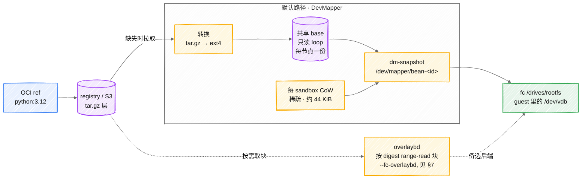

# 镜像链路:OCI ref → 可挂的块设备

> 状态标注约定见 [architecture.md](architecture.md) §0。
> 实现:`internal/node/image/`(registry / convert / devmapper / pulling)。
> 「怎么构建镜像」见 [image-build.md](image-build.md),本文是「已有镜像怎么变成能启动的东西」。

用户交给平台的是 `python:3.12` 这样的普通 OCI ref。fc 档需要的是一个块设备。
本文是这两者之间的全部步骤,以及冷启动 2m45s 花在哪。



默认路径是实线;overlaybd(虚线)是可选的备选后端,跳过转换、改成 range-read 取块。
本文余下部分逐一讲这些步骤,以及冷启动 2m45s 花在哪。

## 1. 三层 Provider ✅

```
PullingProvider          缺镜像时触发转换,并发去重
  └── DevMapperProvider  共享只读 base + 每 sandbox CoW → /dev/mapper/bean-<id>
      (或 FileProvider)  每 sandbox 全量拷贝,无 dm 依赖时兜底

OverlaybdProvider        另一条路,--fc-overlaybd;层按 digest 共享(见 §7)
```

分层而不是一个大 provider 的理由:**「镜像从哪来」和「块设备怎么组」是两件事**。
`PullingProvider` 包着任意一个内层实现,所以「首次使用时拉取」这个行为
不需要在每个块设备后端里重复实现。

`OverlaybdProvider` 站在这个栈**旁边**而不是里面 —— 这是原先的分层没预料到的一处。
它自己把镜像解析成层,因为「取哪些层」和「要不要取层」是同一个决定
(lazy pull 一个都不取)。把它包进 `PullingProvider` 会先跑 ext4 转换器,
产出一个 overlaybd 用不上的东西。

`Provider` 接口很小 —— 组设备,加上上报节点持有什么:

```go
Name() string
Prepare(ctx, sandboxID, imageRef string, opts PrepareOptions) (*Rootfs, error)
Prewarm(ctx, imageRef string) error
Cached() (map[string]CachedImage, error)
Config(imageRef string) (*Config, error)   // §5
Digest(imageRef string) (string, error)
```

`Cached()` 存在是因为**节点是它自己持有什么的唯一权威** —— 心跳上报这份清单,
调度器据此做镜像亲和打分、prewarm job 据此显示进度。让控制面去推断
「节点大概有什么」会立刻和现实分叉。

## 2. 转换:tar.gz 层 → ext4 ✅

```
① ParseReference        解析 ref
② 查 ImageDir           已有则直接返回 ← 不可变语义,见下
③ FetchManifest         registry 认证 + manifest 解析
④ sizeFor(manifest)     从压缩层大小估算文件系统大小
⑤ writeBaseImage        建稀疏文件 → mkfs.ext4 → 挂载
⑥ 逐层 applyLayer       按顺序解压,处理 whiteout
⑦ 补 guest 必需目录     /proc /sys /dev 等挂载点
⑧ 卸载 → rename 就位    原子发布
⑨ 写镜像元数据文件      记住这个文件来自哪个 ref
```

**元数据文件在镜像之后写**,顺序是刻意的:它是 `Cached()` 上报的依据,
所以先写它会让节点宣称持有一个还不能用的镜像 —— 调度器据此把工作放过来,
然后 create 失败。

`refToFilename` 把 ref 编码成文件名(非字母数字转分隔符),而**不同的分隔符
不能都映射成同一个字符**,否则 `a:b` 与 `a/b` 会撞。元数据文件是反向查询的答案:
从文件名推不回原始 ref,所以单独记。

### 不可变语义 ✅

```go
if _, err := os.Stat(final); err == nil {
    // Already converted. Images are immutable once written — a tag that
    // moves is a different digest and so a different file.
    return final, nil
}
```

文件名由 ref 派生,而**移动过的 tag 是不同的 digest,因此是不同的文件**。
所以「已存在就直接用」不会拿到过期内容。这条让转换天然幂等,
也是为什么不需要缓存失效逻辑。

### 为什么先 rename 才可见 ✅

工作目录与 `ImageDir` 必须在同一个文件系统上,因为最后一步是 `rename`:

```
WorkDir/<tmp>.ext4  →  ImageDir/<name>.ext4
```

不这么做的后果很具体:并发的 `Prepare` 会看到一个**写了一半的 ext4**,
把它挂起来然后失败 —— 而失败的样子像「镜像损坏」而不是「竞态」。
这是那种排查一整天才发现是竞态的 bug,所以宁可要求同文件系统。

### 文件系统大小怎么估 ⚠️

```go
sizeMiB := (compressed >> 20) * 3      // 压缩层总和 × 3
if sizeMiB < floor { sizeMiB = floor }  // 不低于 DefaultSizeMiB
if sizeMiB < 256 { sizeMiB = 256 }      // 硬地板
```

**这是估算,不是计算。** manifest 里只有压缩后的大小,而解压比例取决于内容
(文本层能到 5×,已压缩的二进制接近 1×)。× 3 是个中间值,加上地板兜住小镜像。

这个估算**猜小了会失败**(转换时 ENOSPC),猜大了只浪费稀疏文件的名义大小
(实际占用按写入量)。所以偏向猜大。**没有实测过 × 3 的命中率** ——
如果出现转换 ENOSPC,这是第一个要看的地方。

### whiteout:OCI 的删除语义 ✅

层是叠加的,所以「删除」要用标记文件表达:

| 标记 | 含义 | 处理 |
|---|---|---|
| `.wh.<name>` | 删除下层的 `<name>` | `os.RemoveAll(victim)` |
| `.wh..wh..opq` | 清空该目录下层的全部内容 | `clearDir(dir)` |

漏了 whiteout 处理的后果是**上层删掉的文件在 guest 里又出现了** ——
典型症状是删掉的密钥文件、清理掉的构建缓存重新出现,而镜像看起来是好的。

### 路径逃逸防护 ✅

```go
func safeJoin(root, name string) (string, error) {
    clean := filepath.Clean("/" + name)
    joined := filepath.Join(root, clean)
    if joined != root && !strings.HasPrefix(joined, root+string(os.PathSeparator)) {
        return "", fmt.Errorf("layer entry %q escapes the image root", name)
    }
    return joined, nil
}
```

一个恶意或畸形的镜像里可以有 `../../etc/cron.d/x` 这样的条目。
**转换是在节点上以 root 跑的**,所以这不是「guest 内的越权」而是
「直接写宿主文件系统」—— 必须在解压时拒绝,不能依赖后续环节。

先 `Clean("/" + name)` 再 join 是关键:它把 `..` 在**绝对路径语义下**归约掉,
之后的前缀检查才有意义。

### 用 magic bytes 而非 media type 判定 gzip 📐

代码只按 `layer.MediaType` 分支(`convert_linux.go` 的 `applyLayer`),整个包里没有任何
嗅探逻辑。那里的注释描述的是从未实现的意图:

```go
// Most layers are gzipped; the media type says so, but some registries are
// loose about it, so the magic bytes decide.
```

计划是改成用 magic bytes 判定。有些 registry 的 media type 与实际内容不一致,
信 media type 的后果是把 gzip 流当 tar 解(立刻失败)或反之。嗅探是防御性的,
成本是读几个字节。要不要做是另一个决定,这里不下结论。

## 3. 并发去重 ✅

一批 eval 同时启动、都用同一个未缓存的镜像,是**默认场景**而不是边界情况。

```go
func (p *PullingProvider) Prepare(...) (*Rootfs, error) {
    rootfs, err := p.Inner.Prepare(ctx, sandboxID, imageRef, opts)
    if !errors.Is(err, ErrNotCached) {
        return rootfs, err        // 命中,或者是别的错误
    }
    if err := p.ensure(ctx, imageRef); err != nil {   // ← 这里去重
        return nil, err
    }
    return p.Inner.Prepare(ctx, sandboxID, imageRef, opts)
}
```

`ensure` 用 in-flight map 把同一个 ref 的并发请求合并成一次转换,
其余的等结果。**等待方共享结果但保留自己的 cancellation** ——
一个放弃了的客户端不该被别人的拉取拖住,这一点在注释里明确写了。

不去重的后果不只是浪费:N 个进程同时 `mkfs` + 解压同一个镜像到不同临时文件,
磁盘 IO 打满,而它们最后只有一个的产物有用。

## 4. 冷启动的时间去哪了 ⚠️

实测:

```
busybox   5–10 s
alpine    2m45s(网络不稳时)
```

**2m45s 几乎全是网络** —— 拉压缩层。转换本身(mkfs + 解压)是秒级。
所以:

- **prewarm 是必需的,不是优化**。一批 eval 开始前必须把镜像铺到目标节点,
  否则第一批 sandbox 全在等下载
- 这也是 **overlaybd lazy-pull 的价值所在**:它把「下载全部层」换成
  「按需读实际用到的块」。已实测挂载 7ms、只传 19.6% 的层字节就能挂载并读文件
  (decisions §3.1)。**现已接入** —— 见 §7

镜像亲和调度是同一个问题的另一面:同一镜像的重复 eval run 应该落到已有它的节点上。
这条已实装(`Cached()` → 心跳 → 调度打分)。

## 5. 镜像配置:ENV / ENTRYPOINT / CMD / WORKDIR ✅

一个镜像是两样东西:层,以及描述「怎么启动这些层」的 config blob。上面的转换处理了前者、
**丢掉了后者**——把层拍平成 ext4 不携带任何元数据。所以 config 必须走另一条路,
而缺了这条路时,依赖自身 `ENV` 或 `WORKDIR` 的镜像会启动错误,且任何地方都不报错。

这条路分两半,因为 registry 只在转换时可达、创建时不可达:

```
convert  FetchConfig(manifest.Config.Digest)  → Config{Env,Entrypoint,Cmd,WorkingDir,User}
             │                                    写进 .ref 元数据文件
             ▼
create   Provider.Config(ref) → *Config    ┐
         spec.Cmd / spec.Env               ├→ MergeConfig → Process{Argv,Env,Workdir,User}
                                           ┘        │
                                    StartUserProcessRequest → beand exec
```

写进与 ref、digest 同一个 `.ref` 文件而非另开文件:这样一次原子写就发布了节点关于
这个镜像知道的全部信息,读者也不可能看到两者互相矛盾。

### 字段对应关系

| OCI config | 落到哪里 | 状态 |
|---|---|---|
| `Env` | 作为底,被请求的 env 按 key 覆盖 | ✅ |
| `Entrypoint` | `Argv` 头部,**永远保留** | ✅ |
| `Cmd` | `Argv` 尾部,请求带 cmd 时被替换 | ✅ |
| `WorkingDir` | `Workdir`,请求未指定时使用 | ✅ |
| `User` | 记录在 `Process` 上,**未生效** | 📐 |
| `VOLUME` / `EXPOSE` / `HEALTHCHECK` | 忽略 / 仅元数据 / 不执行 | ➖ 与容器运行时一致 |

### 合并规则,以及最容易搞错的那条

```
Argv     = Entrypoint ++ (request.Cmd 非空则用它,否则用 image.Cmd)
Env      = image.Env 作底,request.Env 按 key 覆盖
Workdir  = request.Workdir,否则 image.WorkingDir,否则 agent 默认值
```

**请求的命令替换 `Cmd`,但不动 `Entrypoint`。** 这正是
`docker run python:3.12 -c 'print(1)'` 能把参数传给解释器、而不是去 exec `-c` 的原因。
两个一起覆盖的写法,在所有 `Entrypoint` 为空的镜像上看起来都对——而那恰好是大家测试时
最常用的那批——却会在声明了 `Entrypoint` 的镜像上出错。`config_test.go` 的表驱动测试
专门钉住了这个 case。

Env 按 key 合并而非整体替换,理由同源:镜像的 `PATH` 和调用方多加的一个变量都得活下来,
不能要求调用方为了加一个变量就把镜像的整个环境重写一遍。

### 不同镜像来源的 config

| 来源 | config | 原因 |
|---|---|---|
| registry 拉取 | 来自 config blob | 转换时抓取 |
| `snapshot` 提升 | 从源镜像继承 | 文件系统快照改的是文件系统,不是环境的启动方式 |
| `build` | **没有** 📐 | buildctl 被要求导出 `type=tar` 扁平 rootfs,不含镜像元数据;要拿到 Dockerfile 的 `ENV`/`ENTRYPOINT` 得改成从 builder 导出 OCI 镜像 |

没有 config 时读回来是 `nil`,而不是空的 `Config`;`nil` 的含义是「只按请求启动」——
也就是记录 config 之前所有镜像的行为。区分两者有意义:空 `Config` 会声称
「这个镜像确实没有 entrypoint」。

### `User` 已记录但未生效 📐

值存下来了、也到了 `Process`,但一切仍以 root 运行。它无法在其余字段生效的地方生效:
beand 是 PID 1,降低自己的 uid 就会失去之后 exec 任何东西的能力——必须在子进程里做。
而解析 `nobody` 这类名字还需要 guest 自己的 `/etc/passwd`,那要等 pivot 到镜像 rootfs
之后才存在。所以这是一个独立改动,不是漏掉的一行。

## 6. 封装文件系统:反向路径 ✅

把**文件系统 snapshot** 提升进 image 命名空间,就是把运行中 sandbox 的文件系统封成新的 base 镜像。

当前实现是**从 `/dev/mapper` 上的合成设备读出一个完整 ext4**,
而不是「seal 一个增量层」。理由是 dm-snapshot 的 CoW 层不是 OCI 层格式,
没法直接当层用。

代价:产物是全量镜像而非增量。overlaybd 接入后可以改成
`overlaybd-commit` seal LSMT 可写层 —— 那才是真正的零转换(image-build §2)。

## 7. overlaybd 路径 ✅

拍平之外的另一条路,用 `--fc-overlaybd` 选择。默认关闭 —— 不显式开启时,
节点走的仍是上面的 dm-snapshot。

| | dm-snapshot(默认) | overlaybd |
|---|---|---|
| 首次使用 | 拉全量 + 转换,分钟级 | 按需读块,挂载 7ms |
| 每 sandbox 成本 | 44 KiB(已实测) | 相当,都只存改动 |
| 层共享 | **没有** —— 每个镜像一个独立 ext4 | 按 digest 共享,每层只存一份 |
| 转换 CPU | 每个镜像都付一次,共享层也重复付 | 每个不同的层只付一次 |
| 封装文件系统 | 读出全量 ext4 | 原地 seal 可写层 |

真正让这件事值得做的收益,不是原先写在这里的那个。旧版说价值在首次使用的等待时间、
而 prewarm 能遮掉它 —— 这话没错,但漏了 prewarm **遮不掉**的两项:共享的层只存一份
而不是每个镜像各存一份,以及共享 base 的转换 CPU 每个节点只付一次而不是每个镜像付一次。

### overlaybd 和 ublk 回答的是两个不同的问题 ✅

这两个容易被混成「另一种 rootfs 方案」,而这个混淆已经让本文档的价值排序写错过两次。
它们是正交的两个维度:

| | overlaybd | ublk |
|---|---|---|
| 维度 | **磁盘由什么组成** | **磁盘怎么送到 guest** |
| 替代的是 | 把每个镜像拍平成独立 ext4 | `losetup` + `dmsetup`,或者 TCMU |
| 换来的是 | 层按 digest 共享:省磁盘,且转换 CPU 按「不同的层」付一次而不是按镜像付 | 每 sandbox 不再 `fork+exec`,且 teardown 不再串行化 |
| **不**解决 | create 延迟(冷 create 照样要转换) | 磁盘占用和转换 CPU —— 给它什么它就服务什么 |
| flag | `--fc-overlaybd` | `--fc-ublk` |

因为是不同维度,所以可以组合,四种组合都有意义:

- 都不开:拍平的 ext4 走 device-mapper —— 默认
- 只开 `--fc-ublk`:拍平的 ext4 走 ublk。字节和默认完全一样,但 60 并发下
  `fc_rootfs` 2.461s → 0.034s,因为每 sandbox 三次 `fork+exec` 变成了 io_uring 命令
- 只开 `--fc-overlaybd`:共享层走 TCMU。三个共享 base 的镜像 392 MiB → 118 MiB,
  第三个镜像的转换 CPU 2.2s → 0.44s —— 但拆 128 个设备要 4.0s,且换内核修不掉
- 两个都开:共享层走 ublk。这个组合存在的理由就是上一行那个 teardown 开销在传输层,
  所以唯一的出路是换掉传输层、同时保留层共享

**必须点明的坑:单看这两个,哪个都不会让冷 create 变快。** overlaybd 仍然要先转换每一层
才能组设备,ublk 只改变组好的设备如何呈现。

真正砍掉冷路径的是 **lazy pull**,而它是第三个维度、不属于上面任何一个:它改变的是
「字节到底在不在这台机器上」。两条传输都支持、也都实测过,但走的是不同的机制 ——
TCMU 下发 range 请求的是 overlaybd 守护进程,ublk 下是 noded 自己
(`blobreader.go`、`blobfetch.go`)。ublk 这条路上,guest 从一个不在本地磁盘的层
**358ms** 起来,最多读了 5.1 MiB 层的 60%。

它的前提是唯一需要记住的一点:**那一层必须已经是封好的 overlaybd 层**,因为普通 OCI 层
是 gzip tar、没有可 seek 的块索引。所以 lazy pull 是接在「发布」之后而不是替代「转换」——
每机群每镜像转换一次,之后每个节点都是读而不是转。

### 两个 backend 同机实测 ✅

`hack/overlaybd-bench.sh`。三个 python `-slim` 镜像,共享同一个 debian base
(按 manifest 两两之间 1.51x)。量的是**实占块**而非表面大小 —— 拍平出的 ext4 是稀疏文件,
表面 2.0 GiB、实占约 130 MiB,用表面大小会把拍平路径高估 15 倍。

| | dm-snapshot | overlaybd |
|---|---|---|
| 镜像目录,2 个镜像 | 261 MiB | 94 MiB(**省 2.78 倍**) |
| 镜像目录,3 个镜像 | 392 MiB | 118 MiB(**省 3.32 倍**) |
| noded CPU,第 1 个镜像 | 2.32 s | 1.37 s |
| noded CPU,第 2 个镜像 | 2.24 s | **0.49 s** |
| noded CPU,第 3 个镜像 | 2.15 s | **0.44 s** |

CPU 那一列就是层共享这件事变得可观测的样子。dm-snapshot 上每个镜像的转换开销都一样,
因为每个都要把共享 base 自己拍平一遍;overlaybd 上第 2、3 个镜像只花第 1 个的约三分之一,
因为共享层已经封装在节点上了,只有它们各自独有的层是新的。

磁盘比例随镜像集增大(2.78x → 3.32x)是同一效应的另一面:每多一个镜像,
拍平存储要多存一份完整 base,而层存储几乎不增加。

**注意这组数替换掉了什么。** 这里原先写的 3.1x 来自 `hack/layer-amplification.go`,
那是个读 manifest、按压缩 blob 大小外推的工具,**从来不是这份实现的实测**。
上面这些才是。两者结果吻合 —— 但吻合只是对那个外推的一次校验,不能代替把实测做掉。

### create 延迟:冷启动 vs 已发布 ✅

`hack/overlaybd-lazy-bench.sh`,同一台机器三个臂。第三臂先 prewarm,然后**把节点的层目录
清空**再 create —— 不清的话 create 读的是本地文件,这个测量就与「已发布的那份副本」无关了。

| 臂 | create 1 | create 2 | 镜像目录 |
|---|---|---|---|
| dm-snapshot | 14.3 s | 15.1 s | 261 MiB |
| overlaybd,冷启动(转换在 create 路径上) | 14.0 s | 6.8 s | 96 MiB |
| overlaybd,层已发布、节点无本地层 | **1.3 s** | **1.4 s** | 36 KiB |

**冷启动没有改善** —— 14.0 s 对 dm-snapshot 的 14.3 s,而且同一 backend 多次之间的波动
比两者之间的差异还大。这是「从不 prewarm 的集群」的老实数字,也确实和 overlaybd 出名的那个
卖点正好相反。原因是冷启动仍然是「先转换再创建」:下载每一层、逐层封装、然后组设备,
首次使用做的事比拍平**更多**。

**已发布的 create 快约 10x**,这才是这个设计要的数。它同时也是此前一直没测到的数:
前几轮引用的「两个 backend 都 12–32 s、延迟无改善」,是因为当时测的每个臂都把转换放在了路径上。

同一次跑里用来排除「假通过」的几项证据:事后层目录里 `.obd` 文件为 0(没有发生转换)、
daemon 日志里有 4 层从 `remotefs` 打开、块缓存 32 KiB —— 是按需取的字节,不是整层下载。

这 1.3 s 是在「create 仍需先从 registry 取 manifest 才能查任何一层」的前提下测的。
这一点现在已经不成立了(见下面「存储作为数据源」),但上面那个数字包含它。

真正能赢冷启动的是 lazy pull,而它对普通镜像根本不适用:

| | blob 是什么 | overlaybd 能远程读吗? |
|---|---|---|
| Docker Hub 上的 `alpine:3.20` | gzip 压缩的 tar | ❌ 没有块索引可 seek |
| 转换并推送成 overlaybd 形式的镜像 | 封装好的 LSMT 层 | ✅ 可 HTTP range-read |

所以 **lazy pull 是 blob 的属性,不是节点 flag 的属性**。只喂普通 gzip registry 层的节点
没有任何东西可以 range-read;decisions §3.1 里实测的 7ms 挂载和 19.6% 传输量,对的是一个
**已经转换并封装过**的 blob。

补上这个缺口的是 bean 自己的对象存储,而不是 registry。`Prewarm` 转换镜像并把封装好的层
按 digest 发布;之后任何读同一存储的节点都会在级别 2 命中这些层并 range-read。所以封装形态
确实被产出了 —— 只不过是由第一个执行 prewarm 的节点产出,而非某个集中式流水线。

**真正冷的 create 仍然是一次转换。** 这一点无法绕过:gzip 的 tar 没有块索引可 seek,
所以必须先取回并封装,之后才谈得上按需读。存储买到的是:这件事变成每个镜像**每集群**做一次,
而不是每节点做一次 —— 前提是有人 prewarm。没有 prewarm 时,冷路径与拍平路径完全一致,
prewarm 在这里和在那里一样是必需的。

### 层构建流水线

```
registry 层 (tar.gz)
  │  解压 —— overlaybd-apply 读 tar,不读 tar.gz
  ▼
overlaybd-create --mkfs data index <GB>     建带文件系统的空层
overlaybd-apply  layer.tar apply.json      把 tar 写进去
overlaybd-commit -z -t data index out      封成 zfile blob
  ▼
<layerDir>/sha256-<digest>.obd             按 OCI digest 命名,因此可共享
```

按 digest 而非按镜像命名:这就是层共享的全部机制,也意味着第二个镜像引用
已在本地的层时不需要任何转换。

每 sandbox 的可写层是 `overlaybd-create -s`(稀疏),成本只是写入的块而非虚拟大小 ——
实测空闲 sandbox 占 40 KiB,而表面大小是 1.1 GB。

### create 按什么顺序找层

create 对每一层依次走三级查找,并且**从不发布**。发布是 `Prewarm` 的事,原因见下一节。

| 级别 | 条件 | 层的引用方式 |
|---|---|---|
| 0 | registry blob *本身*就是已封的 overlaybd 层 | `digest` + registry `repoBlobUrl` + `dir=` |
| 1 | 本节点已有 `<layerDir>/sha256-<digest>.obd` | `file=` |
| 2 | 对象存储里已有发布的 blob(仅 lazy pull) | `digest` + 存储 `repoBlobUrl` + `dir=` |
| 3 | 以上都没有 | 本地转换,按 `file=` 引用 |

这个顺序不是随意排的。级别 1 优先于级别 2,是为了让已经在本节点的字节按本地文件读,
而不是绕 daemon 的 HTTP 路径 —— 否则一个本来不会失败的读会凭空多出一个「对象存储必须可达」
的依赖。级别 2 优先于级别 3,则正是发布的意义所在:一个从没见过该镜像的节点直接开始按需读块,
而不是转换。

### 一条链不能一半远程

转换需要父层是**本地文件**,因为 OCI 层是叠加在父层之上的 diff。所以「远程父层 + 转换出的子层」
这种混合链根本没法构建。由这一条约束推出两条规则:

- **prewarm 从不走远程读。** 它的产物整体就是一条本地链,所以为早期层去查存储,会让后面的层
  失去可叠加的父层。
- **create 一旦撞上混合状态,就把整个镜像本地转换。** 这是「部分发布」的镜像 —— 一部分层在存储里、
  后面某层不在 —— 通常源于 prewarm 在镜像中途被打断。这个回退把远程级别本想省下的下载又花掉了,
  但它胜过拒绝一个明明能成功的 create。

第一条不是预防性设计。发布最初是允许查存储的,于是有一次 prewarm **败给了自己先前的发布**:
`python:3.12-slim` 的第 2 层必须转换,而第 1 层已经解析到了存储副本。这是在一次基准测试跑里
暴露的,不是测试里 —— 所以现在覆盖它的那个测试,断言的是「存储已被预置」时 prewarm 仍能成功,
而不是从空存储开始。

### 转换是节点级的工作;发布才让它变成集群级 📐

存在两个粒度不同的去重,而它们各自都不足以让转换变成集群级操作。

- `PullingProvider.ensure` 按**镜像引用**合并并发请求(见 §3)。
- `OverlaybdProvider.materialiseLayer` 按**层 digest** 合并。

细的那个不是多余。共享同一 base 的两个镜像是两个不同的引用,引用级的 map 看不出它们有关系,
但它们指向相同的层 digest。没有 digest 级去重时,`python:3.12-slim` 和 `python:3.11-slim`
的并发 create 会各自拉取并转换共享的 debian base。`buildLayer` 里的 rename 早已让这件事
*正确* —— 两边产出完全相同的字节,一方覆盖另一方 —— 所以唯一的症状就是重复劳动。真机实测:
同一镜像 4 个并发 create,加 flight 前拉取层 blob 4 次,加之后 1 次。

两者都是进程内的 map。**跨节点没有任何协调。** 节点 A 转换出的层对节点 B 不可见,
所以 N 个节点的集群转换同一镜像会做 N 次 —— 这个后端所构建的共享是**节点内**的。

改变这一点的是对象存储,而且只经由 `Prewarm`:

```
Prewarm  →  转换缺失的层  →  发布所有本地层
Create   →  查找(0-3 级) →  从不发布
```

发布最初是放在 create 路径上的,那是个值得记录的错误:它把几十 MiB 的 S3 上传放到了一个
**字节本就在本节点磁盘上**的 sandbox 的延迟路径里,只为让某个可能永远不会到来的后续 create
受益。移到 `Prewarm` 之后,上传落在没人等它的地方。

还有一个「照搬会做错」的细节:在已经转换过该镜像的节点上 prewarm,会命中级别 1 然后什么都
没发布就返回,层于是留在单个节点的磁盘上、对其余节点不可达。所以 `Prewarm` 发布的是任何本地层,
不只是刚转换出来的那些。这个缺口是靠一个断言对象存储调用次数的真机测试发现的,不是靠读代码。

从不 prewarm 的集群依然能正常工作,只是每个节点各自转换一遍。

### 缓存层级

四级。最要紧的一点是**前两者是二选一而不是分层**:一个层要么是本地全量文件,
要么是远程源之上的稀疏缓存,不会同时是两者。

```
节点
├── <layerDir>/sha256-<digest>.obd          全量,承重,按 digest 寻址
├── <layerDir>/cache/sha256-<digest>/       稀疏,可回收,按 digest 寻址
├── /opt/overlaybd/registry_cache           4 GiB LRU,所有层共享
└── <sandbox>/writable.{data,index}         每 sandbox,稀疏,约 40 KiB
```

| 层级 | 存什么 | 生命周期 | 谁共享 |
|---|---|---|---|
| sealed layer 文件 | 整个层 | 直到被回收;**丢了就要重新转换** | 引用该 digest 的所有镜像和 sandbox |
| per-layer 缓存目录 | 只有读过的块 | 可回收 —— 丢了只花带宽,不影响正确性 | 同上 |
| `registry_cache` | 近期读过的块,不限层 | 4 GiB LRU 驱逐 | 节点上所有层 |
| 可写层 | 单个 sandbox 的写入 | 随 sandbox | 无 |

**一个层拿到前两者中的哪一个,由「有没有远程源」决定。** 本地转换出来的层没有回落对象,
所以以 `file=` 引用、是承重的。已发布到对象存储的层以 `digest` + `repoBlobUrl` + `dir=`
引用,daemon 在块存在时从 `dir` 读、不存在时 range-read —— 这才是那份副本可回收的原因。
给远程层设 `file=` 能工作但会丢掉回落;只设 `dir=` 则是一个无处可取的层,`validate()` 会拒。

### 「按需」是什么、不是什么

读在任何情况下都是块粒度的:`refill_size`(默认 **256 KiB**)在 overlaybd 自己的配置里
被描述为「I/O 单位与位图粒度」,所以读一个 17 字节的文件实际拉 256 KiB。
一个 cache entry 是**稀疏文件 + 记录哪些块已填充的位图**,并且有 per-block 的
in-flight 去重 —— 同一块被并发读只回源一次。

各级之间的差别不是读的粒度,而是**字节从哪来**,因此首次使用的代价不同:

| 层的状态 | 首次使用的代价 | 之后的读 |
|---|---|---|
| 本地已封装 | 无 —— 在转换时已付过 | 本地,块粒度 |
| 已发布到存储 | **只有被触碰的那些块** | HTTP 206,之后进缓存 |
| 两者都不是 | 整个层:下载 + 转换 | 本地,块粒度 |

所以按需加载只适用于中间那一行。它无法适用于第三行,因为标准 OCI 层是 gzip 压缩的 tar、
没有块索引 —— 没有可以 seek 进去的东西,这也是 `lowersFor` 拒绝远程引用它的原因。
**整个集群第一次遇到某个镜像时,必然付一次全量下载加转换;这个后端消除的是「再付一次」**,
按节点、按镜像各一次。

### 一份变多份:一百个 sandbox 从同一镜像启动时共享什么

这里才是这套设计值得其复杂度的地方:

- **只读层**是一份,无论全量还是稀疏
- **已取到的块**共享,第二个 sandbox 直接命中第一个拉过的
- 只有**可写层**是每 sandbox 一份,约 40 KiB

共享按 digest 而非按镜像,所以跨镜像也共享:实测第二个 python `-slim` 镜像转换 CPU
只花 0.49s 而第一个花 1.37s,就是共享的 debian base 已经在那了。

### 存储作为数据源,而不是缓存 ✅

只发布层 blob 并不能让存储成为「镜像可以从中被**解析**出来」的东西。一个装满
`blobs/sha256:...` 的前缀只是一堆扁平的层,没有任何信息说明哪些层组成哪个镜像 ——
所以节点仍然得问 registry,而一个「必须问 registry 才能用」的存储是缓存,不是数据源。

三个前缀,后两个才是补上这个缺口的:

```
blobs/<layer-digest>            封装好的层            由 overlaybd daemon 读
manifests/<manifest-digest>     层清单 + OCI config   由 bean 读
tags/<host>/<repo>/<tag>        → manifest digest     由 bean 读
```

注意读者不同,这也是它和 `BlobStore` 分成两个类型的原因。daemon **匿名**读 `blobs/`,
这就是下面那条公开读策略的由来;`manifests/` 和 `tags/` 由 bean 自己带凭据读,没有这个要求。

`tags/` 的 key 除了 tag 还包含 host 和 repository,因为脱离这两者 tag 毫无意义:
Docker Hub 的 `python:3.12` 和某镜像站的 `python:3.12` 是两个恰好同名的不同镜像,
共用一个 key 会让其中一个把另一个的内容服务出去。

**现在 create 什么时候还需要 registry:**

| | 需要 registry |
|---|---|
| tag 已记录在存储里 | 不需要 |
| digest 引用,manifest 在存储里 | 不需要 |
| digest 引用,本节点解析过 | 不需要 —— 本地记录就能答 |
| 从未在任何节点 prewarm 过 | 需要 —— 这就是冷启动,级别 3 |
| prewarm | **永远需要** |

prewarm 是唯一的写入方,并且从不读自己写的答案。这是刻意的:一个从存储得到满足的 prewarm
会变成一个「报告成功的空操作」,而上游 tag 移动后将永远不会被发现。

**由此确立的语义值得明说:** 在下一次 prewarm 之前,「tag 意味着什么」的权威是 bean 的存储,
而不是上游 registry。这期间上游 tag 移动不会被察觉。对 sandbox 平台这是对的默认:
一批 eval 跑到中途悄悄换成新的镜像内容,比跑一个稍旧的镜像糟糕得多 —— 可复现性优先于新鲜度。

同样的理由解释了为什么 **digest** 可以从*本地记录*回答,而 **tag** 不行。digest 不可变,
所以记录下的链就是同一条链;tag 是个指针,把它在本地钉死会让每个节点各自漂移,且没有任何东西
能刷新它们。存储可以被 prewarm 刷新,本地钉死的不能。

### registry 挂掉时仍能启动 ✅

`DevMapperProvider.Prepare` 是纯本地的 —— 它只找一个转换好的文件,从不开 socket ——
所以 registry 不可达时,节点仍能启动它缓存过的每一个镜像。而 overlaybd 的每次 create 都先取
manifest,于是同一个节点**什么都启动不了**。这是这个后端引入的回退,不是它的固有属性。

现在 create 会退回到节点记录下的层链,告警说明用的是「上次拉取时该引用解析到的版本」,然后启动。
两个「只改一半就会漏掉」的细节:

- **config 在自己的 blob 里**,所以 manifest 从本地答出来之后,路径上仍留着一次 registry 取用。
  不一并处理的话,离线 create 只是多走一步再失败 —— 而一个 `ENV` 和 `ENTRYPOINT` 全空却启动了的
  sandbox 比启动不了更糟。
- **调用方自己取消**不等于 registry 不可达,不能用陈旧记录去回答它。

prewarm 不做这个回退,理由见上。

### 对象存储必须允许匿名读 ⚠️

**daemon 读对象存储时不带任何凭据。** 它走 registryfs,完全不认识 SigV4,
所以 `noded` 用来签上传的那对 key 对它没有帮助。

于是私有 bucket 的失败方式毫无信息量:MinIO 对 daemon 的 range 请求回 403,
registryfs 去找可跟随的 `WWW-Authenticate` 挑战、找不到、记一条 `connection failed`,
最后以 configfs `enable` 写入时的 `ENOENT` 冒出来。整条链路里没有一处提到 bucket 或它的策略。
这个坑花掉了一整轮基准测试才找到。

MinIO 上一条命令即可:

```
mc anonymous set download <alias>/bean-obd-layers
```

`noded` 现在会在启动时用**不带签名**的 range 请求探一次,若存储要求凭据就告警并给出修复命令。
是告警而不是拒绝启动:读不到存储的节点仍然能工作,只是每层都本地转换。

注意这带来的不对称 —— **写要认证,读不要。** 该前缀下只有封装好的层 blob,
它们是内容寻址的、且派生自 registry 本就对外提供的镜像,所以公开可读的暴露面比听起来小。
但这仍然是一个部署决策,存放其他东西的存储应该另开 bucket。

### 两个不该由代码决定的设置

`/etc/overlaybd/overlaybd.json` 属于 overlaybd 这个包 —— bean 读它
(builder 把它传给 `overlaybd-apply`),从不写它。其中两个默认值值得专门说:

**`download.enable` 必须设成 `false`。** 默认是 `true` 且 `delay: 600`,
意味着 daemon 会在**十分钟后于后台把层的其余部分拉全**。稀疏缓存于是长成全量副本,
这与按需读恰好相反。对活几十秒的 eval sandbox 无影响;长跑的会悄悄拉走整个镜像。

**`cacheConfig.cacheSizeGB`(默认 4 GiB)是节点级上限**,所有层共享。
跑几百个不同镜像的批量任务时,这是第一个该调大的值;它太小的症状不是报错而是驱逐 ——
已经付过代价的块被重新取一遍。

### 怎么暴露成块设备

overlaybd 自己没有块设备接口,由内核的 SCSI target 子系统提供,而驱动它的方式
全是往 configfs 写文件。顺序不是风格问题:

```
1. mkdir  core/user_999/<name>              建 TCMU backstore
2. write  control = dev_config=overlaybd/<config.json>,dev_size=N
3. write  wwn/vpd_unit_serial = <hex>       必须在 enable 之前,见下
4. write  enable = 1
5. mkdir  loopback/<wwn>/tpgt_1
6. write  tpgt_1/nexus = <wwn>              必须在 LUN 之前
7. mkdir  tpgt_1/lun/lun_0
8. symlink lun_0/virtual_scsi_port -> backstore
```

### 四条约束,每条都来自真机

这些都不会给出指明原因的报错,所以在代码里连同理由一起强制,而不是留给文档。

**1. nexus 必须在 LUN 之前。** SCSI host 在 fabric 注册时扫描 LUN,而注册发生在写
nexus 那一刻;之后再链接的 LUN 永远不会被扫描,后写 nexus 也不触发重扫。
实测:顺序错时没有设备出现,而 configfs 报告 `enable=1`、`Status: ACTIVATED`,
overlaybd 自己的 result 文件也说 success。没有任何地方报错。

**2. 每个 backstore 都要有唯一的 unit serial,且必须在 `enable=1` 之前写。**
TCMU 默认不提供,于是设备 WWID 都是 `36001405` 后跟一串零。multipathd 看到相同
WWID,判定它们是同一个 LUN 的两条路径,于是合并 —— **把一个 sandbox 的数据喂给
另一个**,而原设备还会变成 busy 无法直接挂载。已现场复现:没设 serial 的设备被并进
`mpatha`,设了的那个保持独立。

**3. serial 必须只含十六进制字符。** 内核用 serial 里的**十六进制字符**构造 WWID,
其余全部丢弃:`bean-aaa` 变成 `naa.6001405beaaaa000...`。所以 `bean-sbx-alpha` 和
`bean-probe-2` 都归约成 `beabaa` —— 两个看起来唯一实际相撞的 serial,
也就是第 2 条那个坑,只是更难发现。`deviceSerial` 把 sandbox id 哈希成十六进制,
而 `attachTCMU` 对非十六进制的 serial **直接拒绝**而不是替调用方净化,
这样到内核的值就是调用方选的值。

**4. 下层必须是 sealed 的。** 把刚 apply 完(未 seal)的层当 lower,daemon 会报
`trailer magic, trailer type, file type or sealedness doesn't match` 并让 backstore
停在 DEACTIVATED —— 而这传到调用方只是 `enable` 写入时的 `ENOENT`,真实原因在
`/var/log/overlaybd.log` 里。相关地,**构建**层时喂给 `overlaybd-apply` 的临时 config
的 lowers 必须**为空**:把该层写成自己的 lower 等于让 overlaybd 把同一个文件同时当
只读父层和可写目标,报错只有 `failed to create image file`。

另外两个「看起来该能用但不能」的细节。teardown **不写** `enable=0` ——
内核拒绝这个写入(`For dev_enable ops, only valid value is 1`),backstore 靠删目录拆除。
以及查 LUN 对应的块设备要走 WWID,因为 `udev_path` 始终为空、SCSI model 对所有这类设备
都读作 `TCMUdevice`、而 `statistics/scsi_port/dev` 是全局端口计数器而非 tcm_loop
adapter 号(某个报 26 的 LUN 实际由 `tcm_loop_adapter_24` 提供)。

### 验证了什么,没验证什么

三个层次,因为每一层回答的问题都是下一层答不了的。

**provider 层** —— `internal/node/image/overlaybd_hw_linux_test.go` 跑真二进制、
真 configfs、真块设备,宿主不支持时跳过。内容:构建并封装层(并确认第二次调用复用)、
attach、**挂载设备并读回层里那个文件**、确认两个设备拿到不同 WWID。

**约束层** —— `hack/overlaybd-probe.sh` 断言测试断言不了的反面情况:
LUN 在 nexus 之前链接时确实没有设备出现,以及在没设 serial 的设备上现场复现
multipathd 合并。

**端到端** —— `hack/overlaybd-e2e.sh` 用 `--fc-overlaybd` 起一个真的全栈,
**从 overlaybd 设备启动一个 sandbox**。在验证机(内核 5.15、TCMU、multipathd active、
AMD EPYC 7542)上全部通过:节点选中 overlaybd 而非降级、`bean run --image alpine:3.20`
成功、guest 从自己的 rootfs 读到 `PRETTY_NAME="Alpine Linux v3.20"`、写入落到可写层、
运行中的 sandbox 有对应 TCMU backstore、镜像的 PATH 进了 guest 环境、
`bean kill` 之后无 backstore 残留也无 multipath 设备。

最后这层才是关键:宿主能挂载的设备和 guest 能从它启动是两个不同的断言,
只有这一层能把这个缺口补上。

**尚未验证**:对真 registry 的 lazy pull(`--fc-overlaybd-lazy-pull` 已实现但没测过 ——
实测的 7ms 挂载和 19.6% 传输量来自 decisions §3.1 的手工验证,不是这份代码)、
以及并发批量创建下的表现。ublk 会比 TCMU 快但需要内核 ≥ 6.0;
TCMU 功能上是完整的。

用之前值得知道的一个数:**镜像首次使用比 CLI 默认等待时间更慢**,因为要先转换层
才能组设备。e2e 脚本给了 120s。这条改动完全没有改善冷路径 —— prewarm 仍是必需的,
真正能消掉它的是 lazy pull。

## 8. 还没有的 📐

- **缓存回收**:`ImageDir` 里的 base 镜像不自动清理。设计里有镜像粒度 LRU +
  chunk LRU(noded-design §4.2),零实现。长期跑会填满磁盘
- **构建产物上传 S3**:构建出的镜像落节点本地,所以**只在构建它的节点可用**
  (GitHub #22)。多节点集群里这基本等于不可用
- **digest 校验**:拉取时不校验层 digest。registry 是可信的前提下问题不大,
  但这是供应链防护的一环
