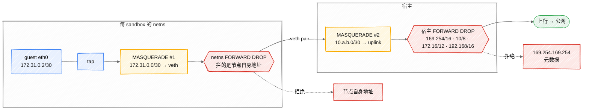

# sandbox 网络:每 sandbox 一个 netns + 固定 guest 地址

> 状态标注约定见 [architecture.md](architecture.md) §0。
> 实现:`internal/node/network/`(地址池、netns、NAT)、
> `internal/node/runtime/fc_linux.go`(网卡注册与 restore 覆盖)。

sandbox 网络**已实现并交付**:每 sandbox 一个 netns + 地址池 + 两层 MASQUERADE +
FORWARD DROP + DNS,并在真机 guest 上用规则计数器验证过(status.md 明确标
「Sandbox networking ✅ / Port exposure ✅」)。SWE-bench 类任务要 `pip install` /
`git clone`,所以这从来就不是一个可以排后面的优化项 —— 它曾是让 bean 用不了的那个缺口,
现在已经补上。剩下的只是一些细化项(MTU 调优、tc 带宽限速、IPv6、conntrack 上限,见 §8)。

本文的核心不是「怎么建 tap」,那是三行 `ip` 命令。核心是
**「快照恢复出的 guest 带着原来的 IP,而它可能落在已经有人用那个 IP 的机器上」**。
这一条决定了整个设计。

## 1. 约束:快照恢复带回原来的地址 ✅(已确认)

Firecracker 的快照包含整机配置,恢复出的 guest **以完全相同的网络配置继续运行,
最重要的是相同的 IP**(上游 `network-for-clones.md` 明确写了)。
默认情况下它还会去找**快照创建时那个 tap 名字**。

所以 fan-out 场景 —— 一个准备好的环境派生 N 个实例,这正是 eval 的核心用法 ——
天然产出 **N 个 IP 与 MAC 都相同的 guest**。三种应对:

| 方案 | guest 侧要改吗 | 代价 |
|---|---|---|
| 每 sandbox 分配不同 guest IP | **要**。恢复后必须让 guest 重新编号 | 需要带内通道下指令(vsock),而且 ARP 缓存要等超时 |
| 每 sandbox 一个 netns,guest 地址固定 | **不用** | 每 sandbox 一个 netns + veth + 两层 NAT |
| 桥接到一个共享网段 | **要** | 同上,且 N 个相同 MAC 在同一个二层域里必然冲突 |

**选第二个:guest 侧零改动。** 理由不是省事,是可靠性 ——
让 guest 重新编号意味着恢复路径上多一次「下发指令 + 等 guest 执行 + 等 ARP 超时」,
而其中任何一步失败都表现为「sandbox 起来了但网络时好时坏」,
那是最难排查的一类故障。上游文档也专门警告了 ARP 陈旧条目会让
**恢复后的 guest 用旧的链路层地址长达 arp cache timeout 秒**。

固定地址还有个副作用是好的:guest 的 cmdline 与网络配置在快照前后完全一致,
少一个恢复时要对齐的东西 —— 和 vsock 用常量 CID 3 是同一个道理
([vm-assembly.md](vm-assembly.md) §7)。

### 已实测确认的两件事

**同名 tap 可以在不同 netns 里共存**(这是本方案成立的前提):

```
ip netns exec bean-probe-a ip tuntap add name beantap0 mode tap
ip netns exec bean-probe-b ip tuntap add name beantap0 mode tap
→ beantap0  DOWN  da:b8:ae:9e:9e:93     (netns a)
→ beantap0  DOWN  82:7d:d5:94:bb:cf     (netns b)
```

**进 netns 不改变工作目录**(`hack/netns-cwd-probe.sh`):

```
outside netns: /tmp/bean-cwd-check
inside netns:  /tmp/bean-cwd-check
```

第二条比听起来重要:**快照可移植性完全依赖 `cmd.Dir` + 相对路径**
(vm-assembly §5)。如果进 netns 会改 cwd,加网络就会静默破坏快照恢复。
先验证再动手,因为这种破坏不会报错。

## 2. 地址布局 ✅

```
guest 内(每个 sandbox 都一样,快照可以随便搬)
  eth0    172.31.0.2/30
  default via 172.31.0.1

netns 内(每 sandbox 一个 netns,名字 bean-<sandboxID>)
  beantap0  172.31.0.1/30        ← guest 的网关
  veth-in   10.<a>.<b>.2/30      ← 每 sandbox 唯一
  default via 10.<a>.<b>.1

宿主
  veth-<idx>  10.<a>.<b>.1/30
  POSTROUTING -s 10.<a>.<b>.0/30 -o <uplink> -j MASQUERADE
```

### 为什么 guest 段用 172.31.0.0/30

**不能用上游文档推荐的 `172.16.0.0/12`** —— 宿主上 Docker 已经占了
`172.17`、`172.18`、`172.19`、`172.20`、`172.21`、`172.22`(实测 `ip route`),
而这个平台的设计前提就是与别的工作负载共存一台机器。撞上去的后果是
sandbox 的流量被 Docker 的 MASQUERADE 规则吃掉,表现为「网络偶尔不通」。

`172.31.0.0/30` 在 Docker 默认分配范围的末端,冲突面最小。
**但这仍然是一个可能撞的选择**,所以要:
- 启动时检查该网段是否已被路由占用,占用了就**明确报错**而不是继续
- 网段可配置(`--guest-subnet`),因为没有任何一个私有网段是绝对安全的

`/30` 只有两个可用地址(网关 + guest),这正好是点对点链路需要的。
用更大的掩码只是浪费,而且会让「一个 sandbox 一条链路」这个不变量看起来可以打破。

### 为什么宿主侧要按 index 分配

netns 里的地址可以全都一样(那是 netns 的意义),但 **veth 的宿主端不行** ——
它们都在宿主的网络命名空间里。所以按 sandbox 的池索引算:

```
10.<idx/64>.<idx%64*4>.1/30    宿主端
10.<idx/64>.<idx%64*4>.2/30    netns 端
```

`/30` 步进 4,每个 `10.x.y.0/30` 是一条独立链路。`10/8` 能放
64 × 64 × 64 = 262144 条,远超一台机器的 sandbox 数 ——
**上限不该由地址空间决定**,那会变成一个需要解释的奇怪限制。

## 3. 地址池必须能在 noded 重启后重建 ✅

这一条是 loop device 那次泄漏教给我的([decisions.md](decisions.md),GitHub #16):
**引用计数活在进程内存里,重启就丢,而宿主上的东西还在。**
当时的后果是每次重启泄漏一个 loop device;这里的后果更糟 ——
重新分配一个已经在用的索引,两个 sandbox 的 veth 地址冲突。

所以池**不维护自己的权威状态**,而是从宿主重建:

```go
// 启动时:列出 bean- 前缀的 netns,解析出索引,标记为已占用
// 分配时:取第一个空闲索引
// 释放时:删 netns(veth 随之消失),清 NAT 规则
```

**宿主是唯一权威**,和 `Provider.Cached()` 让节点上报自己持有什么是同一个原则
([image-pipeline.md](image-pipeline.md) §1)。控制面或内存里的账本都会和现实分叉。

重启后**接管而不是清理**:一个已存在的 `bean-<id>` netns 可能正服务着
重启前就在跑的 sandbox。判断孤儿要和控制面的 `SyncState` 期望集合比对,
这属于宿主资源对账(GitHub #17),不在本文范围。

## 4. restore:用 network_overrides 而不是改 guest ✅

`fcNetOverride`(fc_api.go:192,被 fc_linux.go:79 与 fc_lifecycle_linux.go:519 引用)
就是为这个存在的:

```json
"network_overrides": [{"iface_id": "eth0", "host_dev_name": "beantap0"}]
```

**在我们的方案里 restore 路径靠 tap 同名成立**:tap 名字在每个 netns 里都是 `beantap0`,
所以快照记录的名字在新 netns 里已经是对的,override 通常不额外触发。这是「同名 tap
分 netns 共存」那个性质的直接好处。

保留这个字段的理由是**它是唯一的逃生舱**:如果将来某个场景必须换 tap 名
(例如 jailer 接入后 netns 的组织方式变了,GitHub #20),
不用它就只能让 guest 重新编号。

**ARP 缓存要在恢复后清**:上游明确警告恢复出的 guest 可能用旧的链路层地址
长达 arp cache timeout 秒。netns 是新建的,所以宿主侧的邻居表是干净的;
但 guest 内的表是快照带回来的。这一条**需要真机验证**,
因为它决定要不要在 agent 里加一次 `ip neigh flush`。

## 5. 出网:两层 MASQUERADE ✅



两层 MASQUERADE,以及**两个作用域拦不同的东西**:宿主作用域拦元数据服务和 RFC1918 段,
而节点自身地址是被 netns 作用域的规则拦下的 —— 本地投递的包根本不经过宿主 FORWARD 链(§5a)。

```
netns 内:  POSTROUTING -s 172.31.0.0/30 -o veth-in -j MASQUERADE
宿主:      POSTROUTING -s 10.<a>.<b>.0/30 -o <uplink> -j MASQUERADE
```

两层是因为有两次地址翻译:guest 段 → veth 段 → 宿主上行。

**规则必须能精确删除。** 宿主的 `nat` 表上已经有 Docker 的六条 MASQUERADE,
误删是灾难性的。所以每条规则按 `-s <本 sandbox 的 /30>` 精确匹配,
删除时用同样的参数 `-D` —— 不用 `-F`,永远不用。

**没有 DNAT,入网照样通。** 沙箱内的端口可以从节点外到达,但不是靠改写目的地址:
noded 进入该沙箱的 namespace 后从里面发起连接,所以 guest 地址从头到尾不需要在
别处可路由。

这个区别省掉了一笔代价。DNAT 需要「每沙箱每暴露端口一条规则」加一个宿主端口池,
而池就是重启后要重建的东西 —— 正是本设计想避免的。进 namespace 两者都不需要:
guest 地址在每个沙箱里都一样,靠 namespace 区分。

路径是 `bean-proxy` → noded 的转发端口 → namespace → `172.31.0.2:{port}`,
`{port}` 从 Host 头读出。见 api-design.md §6。

## 6. DNS ✅

guest 的 `/etc/resolv.conf` 来自用户镜像,而镜像里写的可能是任何东西。
两种做法:

- **agent 写 resolv.conf**:pivot 之后、exec 用户命令之前写入宿主的解析器
- **让 netns 里的 dnsmasq 应答**:多一个进程要管

选前者。写文件是幂等的、可检查的,而且**失败方式明确**(写不进去就报错),
不像多一个守护进程那样会以「解析偶尔超时」的形式失败。

要写什么解析器地址:**不能直接抄宿主的 `/etc/resolv.conf`** ——
那里面可能是 `127.0.0.53`(systemd-resolved),从 guest 看是它自己。
所以取宿主的上游解析器,或者由节点配置指定(`--guest-dns`)。

## 7. 分阶段 ✅

网络是唯一一个「做一半比不做更糟」的模块:一个网络时好时坏的 sandbox
会让人怀疑自己的代码,而不是怀疑平台。所以按三步来建,每步都做了真机验证:

1. **单个 sandbox 出网**。netns + tap + veth + 两层 NAT,手工建,
   验证 guest 里 `ping 8.8.8.8` 和 `apk add curl` 能通
2. **地址池 + 并发**。N 个 sandbox 同时有网络且互不干扰,
   noded 重启后不重复分配。压测要覆盖「创建到一半失败」的清理路径
3. **快照 restore 保持网络**。从快照恢复的 sandbox 网络仍然通 ——
   这一步是全文的重点,也是最可能发现 ARP 问题的地方

## 8. 还没定的 📐

- **guest 内 ENOSPC 那类问题的网络版**:tap 建好但 guest 没配上地址时,
  表现是什么?需要确认它会不会像磁盘那样「看起来正常实际不通」
- **MTU**:上行是 1500,两层封装后是否需要调小,未测
- **带宽限制**:Firecracker 有 per-device rate limiter,没用。
  一个 sandbox 跑满上行会影响同机所有 sandbox
- **IPv6**:完全没考虑
